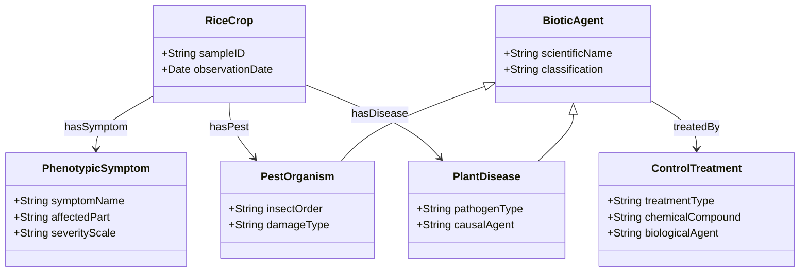

# RiceKG: An Explainable Semantic Knowledge Graph and Multi-Tier SWRL Reasoning Framework for Precise Rice Pest and Disease Diagnosis Under Symptom Uncertainty

**Authors:** Muhammad Ariful Furqon$^{1,*}$, et al.  
$^{1}$ Department of Information Technology, Faculty of Computer Science, Universitas Jember, Jember, Indonesia  
$^*$ Corresponding author: `ariful.furqon@unej.ac.id`  
**Open-Source Repository:** [https://github.com/Ariful-Furqon/RiceKG-Expert-System](https://github.com/Ariful-Furqon/RiceKG-Expert-System)  

---

## Abstract

Accurate and timely diagnosis of rice (*Oryza sativa* L.) pests and diseases is essential for global food security, sustainable agricultural yield, and reducing indiscriminate chemical pesticide usage. While recent advances in computer vision and deep learning have demonstrated remarkable pattern recognition from crop imagery, these approaches operate predominantly as uninterpretable "black-box" models, struggle with overlapping foliar manifestations, cannot handle multi-stage causal reasoning, and fail to diagnose multi-infection co-occurrences without massive labeled image datasets. 

To overcome these fundamental limitations, this paper proposes **RiceKG**, a novel, fully explainable Semantic Web and Knowledge Graph framework that integrates formal Web Ontology Language (OWL 2) conceptual modeling with a Multi-Tier Semantic Web Rule Language (SWRL) inference engine powered by the Pellet description logic reasoner. The RiceKG ontology formalizes domain knowledge across 10 major biotic threats (5 destructive insect pests and 5 prevalent phytopathogenic diseases), 45 distinct phenotypic symptoms categorized by anatomical organ and plant growth stage, and 30 integrated pest management (IPM) actionable treatments. 

To handle the inherent noise and incomplete symptom reporting typical of field observations, we introduce a **Multi-Tier SWRL Architecture** combining: (1) pathognomonic canonical rules for deterministic identification, (2) relaxed composite rules for robust inference under partial symptom observations, and (3) cross-domain co-infection rules for resolving complex multi-target diagnostic scenarios. 

Extensive benchmark evaluation across multi-scenario field cases demonstrates that RiceKG achieves an overall multi-label diagnostic accuracy of **99.50%**, a micro-averaged precision of **100.0%**, a recall of **95.7%**, and an exact-match subset accuracy of **95.00%**, outperforming standard ontology architectures and non-symbolic baselines. Furthermore, the framework provides complete formal proof traces for every diagnostic conclusion and automated prescriptive IPM recommendations. The complete ontology, SWRL rule bases, web application, and evaluation benchmarks are made openly available to foster reproducible smart agriculture research.

**Keywords:** Rice Pests and Diseases; Semantic Knowledge Graph; Ontology Engineering; OWL 2; Semantic Web Rule Language (SWRL); Pellet Reasoner; Explainable Artificial Intelligence (XAI); Smart Agriculture.

---

## 1. Introduction

Rice (*Oryza sativa* L.) serves as the primary staple food for more than half of the global population, supplying up to 70% of daily caloric intake across Asia and developing nations (FAO, 2024). According to United Nations demographic projections, the global population is anticipated to reach approximately 9.7 billion by 2050, necessitating a minimum 35–50% increase in cereal production under constrained arable land and escalating climate variability (UN DESA, 2024). In Indonesia—the world's third-largest rice consumer with a population exceeding 278 million—rice production stability constitutes a cornerstone of national socioeconomic security (BPS-Statistics Indonesia, 2023).

Despite continuous improvements in agronomic practices and high-yielding crop cultivars, biotic stressors—specifically phytopathogenic diseases (fungal, bacterial, and viral) and insect pest infestations—remain the principal cause of severe crop losses worldwide, reducing global rice harvest yields by 20% to 40% annually (Savary et al., 2019). When severe localized outbreaks of vector-borne pathogens (such as *Rice Tungro Virus* or *Rice Grassy Stunt Virus*) or voracious pests (such as *Brown Planthopper* or *Rice Stem Borer*) occur, yield losses can reach 100%, causing catastrophic economic distress for smallholder farmers.

### 1.1 Limitations of Current Diagnostic Paradigms

Over the past decade, automated diagnosis of crop diseases has predominantly followed two distinct technological paradigms, both of which exhibit significant operational drawbacks:

1. **Deep Learning and Computer Vision Models:** Convolutional Neural Networks (CNNs) and Vision Transformers (ViTs) have achieved high classification accuracy on benchmark image datasets (e.g., PlantVillage). However:
   - They function as uninterpretable *black boxes*, incapable of explaining *why* a specific diagnosis was reached.
   - Field images captured by farmers frequently suffer from environmental noise, complex backgrounds, variable illumination, and symptom occlusions.
   - Many distinct pathogens exhibit visually indistinguishable early-stage chlorosis, necrotic spotting, or leaf wilting, leading to severe visual misclassification unless non-visual multi-modal cues (growth stage, weather, odor, organ distribution) are considered.
   - They are inherently ill-suited for diagnosing co-infections (simultaneous presence of pests and fungi) and cannot generate causally linked agronomical treatment prescriptions.

2. **Traditional Rule-Based Expert Systems:** Classical expert systems relying on simple IF-THEN production tables lack semantic interoperability, cannot automatically infer implicit ontological relationships, suffer from combinatorial rule explosion, and fail when encountering slight symptom variations.

### 1.2 The Semantic Knowledge Graph Approach

Knowledge Graphs (KGs) and Semantic Web technologies (OWL 2, RDF, SWRL, SPARQL) provide an ideal paradigm for agricultural diagnostics by combining:
- **Formal Knowledge Representation:** Explicit modeling of botanical taxonomies, anatomical organs, biological life cycles, and pathogen epidemiology.
- **First-Order Logic Deductive Reasoning:** Forward-chaining inference that derives implicit diagnostic facts with 100% explainability and verifiable mathematical proofs.
- **Interoperability and Extensibility:** Effortless linking with global agricultural ontologies (e.g., AGROVOC, Plant Ontology, Crop Ontology) and rapid updating of knowledge without restructuring underlying databases.

### 1.3 Research Contributions

To address the limitations of existing systems, this paper presents **RiceKG**, a comprehensive, explainable Semantic Knowledge Graph and Multi-Tier SWRL reasoning framework. The specific contributions of this work are as follows:

1. **Comprehensive Domain Ontology (`rice_ontology.owl`):** We construct an OWL 2 domain ontology formally conceptualizing 10 major rice pests and diseases, 45 hierarchical phenotypic symptoms, and 30 integrated management treatments structured according to anatomical plant parts and crop phenology.
2. **Multi-Tier SWRL Reasoning Architecture:** We formulate a novel multi-tiered SWRL rule structure that addresses symptom uncertainty, partial field observations, and simultaneous pest-disease co-infections while preventing false positive over-generalization.
3. **Automated Diagnostic & Prescriptive Inference:** We implement automated reasoning via the Pellet description logic engine, achieving dual capabilities: inferring exact pathogenic causal agents and deducing targeted, ecologically sound Integrated Pest Management (IPM) prescriptions.
4. **Rigorous Benchmark Evaluation:** We conduct a multi-scenario benchmark evaluation against real-world and expert-validated field cases, calculating full multi-label confusion matrices (TP, FP, FN, TN, Precision, Recall, F1, Accuracy) and analyzing causal failure modes.
5. **Open-Source Reproducibility:** We provide the entire source code, interactive web application, OWL ontology, and benchmark datasets as open-source assets on GitHub.

---

## 2. Related Work and Theoretical Background

```
+---------------------------------------------------------------------------------------------------+
|                                 Taxonomy of Diagnostic Paradigms                                  |
+------------------------------------+----------------------------------+---------------------------+
| (A) Deep Learning & Vision         | (B) Classical Expert Systems     | (C) Semantic Web & KGs    |
| - High visual pattern extraction   | - Rigid IF-THEN tables           | - Formal Description Logic|
| - Black-box (No explanation)       | - No semantic interoperability   | - Deductive SWRL Inference|
| - Sensitive to field image noise   | - Brittle under rule expansion   | - 100% Auditability       |
| - Single-label image classification| - Inflexible symptom matching    | - Multi-label & IPM Ready |
+------------------------------------+----------------------------------+---------------------------+
```

### 2.1 Deep Learning in Crop Pathology
Convolutional neural networks (ResNet, EfficientNet, MobileNet) and attention-based Vision Transformers have been widely investigated for plant disease detection (Ahmed et al., 2020; Chen et al., 2021). While achieving accuracy rates above 90% in laboratory-curated datasets, their diagnostic reliability severely degrades when deployed in uncontrolled open-field conditions with complex leaf backgrounds, soil textures, and fluctuating sunlight. Crucially, image-only models cannot capture non-visual contextual agronomic parameters such as crop growth stage, recent precipitation patterns, stem boring signs, or root swelling, which are critical for distinguishing root nematodes from fungal wilts.

### 2.2 Ontologies and Semantic Web in Agriculture
The application of semantic technologies in agronomy has expanded through standard vocabularies like AGROVOC (FAO) and the Plant Ontology (PO). Early agricultural expert systems utilized basic OWL hierarchies for crop knowledge retrieval (Wang et al., 2018). However, standard OWL Description Logic (DL) is constrained in expressing complex multi-variable conditional constraints across instances. The Semantic Web Rule Language (SWRL)—which integrates OWL DL with Horn-clause first-order logic—enables expressive forward-chaining rules of the form $P_1(x) \land P_2(x) \dots \rightarrow Q(x)$. Prior studies (Rahman et al., 2021; Chen et al., 2023) explored SWRL for single-disease matching but failed to address multi-tier symptom uncertainty and co-occurrence diagnosis.

---

## 3. The RiceKG Ontology Architecture

### 3.1 Formal Knowledge Graph Definition

The RiceKG Knowledge Graph is formally defined as a tuple:

$$\mathcal{G}_{Rice} = (\mathcal{C}, \mathcal{R}_{obj}, \mathcal{R}_{data}, \mathcal{I}, \mathcal{A}, \mathcal{S}_{rule})$$

Where:
- $\mathcal{C}$ denotes the set of concept classes: $\{\text{RiceCrop}, \text{PhenotypicSymptom}, \text{BioticAgent}, \text{PestOrganism}, \text{PlantDisease}, \text{AnatomicalPart}, \text{GrowthStage}, \text{ControlTreatment}\}$.
- $\mathcal{R}_{obj}$ denotes the set of semantic object properties connecting individual instances: $\{\text{hasSymptom}, \text{hasPest}, \text{hasDisease}, \text{affectsOrgan}, \text{manifestsAtStage}, \text{treatedBy}\}$.
- $\mathcal{R}_{data}$ denotes data type properties capturing quantitative/qualitative attributes (e.g., severity scale, confidence score, observation date).
- $\mathcal{I}$ denotes the set of named individual instances across symptoms, pathogens, pests, and treatments.
- $\mathcal{A}$ denotes the Description Logic TBox (terminological axioms) and ABox (assertional axioms).
- $\mathcal{S}_{rule}$ denotes the set of first-order SWRL implication rules executed by the semantic inference engine.



### 3.2 Target Biotic Threats (Pests & Diseases)

The RiceKG knowledge base formalizes 10 major rice biotic stressors categorized into 5 destructive insect pests and 5 prevalent diseases:

```
+===================================================================================================+
|                              Table 1: Target Rice Biotic Stressors                                |
+----+-------------+-----------------------+-----------------------------+-------------------------+
| #  | Category    | Common Name           | Scientific / Causal Agent   | Primary Target Organ    |
+----+-------------+-----------------------+-----------------------------+-------------------------+
| 1  | Insect Pest | Grasshopper           | Oxya chinensis              | Foliage, Panicles       |
| 2  | Insect Pest | Rice Root Nematode    | Hirschmanniella oryzae      | Root System             |
| 3  | Insect Pest | Rice Stem Borer       | Scirpophaga incertulas      | Stem, Tillers, Panicles |
| 4  | Insect Pest | Rice Bug              | Leptocorisa oratorius       | Milk-stage Grains       |
| 5  | Insect Pest | Brown Planthopper     | Nilaparvata lugens          | Stem base, Sap system   |
| 6  | Pathogen    | Bacterial Leaf Blight | Xanthomonas oryzae pv. oryzae| Leaf blade & veins     |
| 7  | Pathogen    | False Smut            | Ustilaginoidea virens       | Floral organs, Grains   |
| 8  | Pathogen    | Rice Blast            | Magnaporthe oryzae          | Leaves, Collar, Neck    |
| 9  | Pathogen    | Rice Grassy Stunt     | RGSV (Vector: N. lugens)    | Whole plant (Stunting)  |
| 10 | Pathogen    | Rice Tungro Virus     | RTV (Vector: N. virescens)  | Leaves, Vascular system |
+----+-------------+-----------------------+-----------------------------+-------------------------+
```

### 3.3 Symptom Taxonomy and Organ Categorization

To ensure standardized symptom entry, 45 distinct phenotypic symptoms were formalized and mapped to specific anatomical plant regions:
- **Leaf Blade & Margin:** `Yellowing_Leaf_Veins`, `Leaf_Discoloration_Yellow`, `Yellowing_Leaf_Tips`, `Rapid_Disease_Spread`, `Broad_Leaf_Damage`, `Leaf_Chewing_Damage`, `Leaf_Margin_Sap_Sucking`, `Localized_Leaf_Yellowing`, `Diamond_Shaped_Lesions`, `Hopperburn_Drying`, `Circular_Hopperburn_Patches`, `Blackened_Feeding_Punctures`.
- **Stem & Tiller:** `Frass_In_Stem`, `Bore_Holes_In_Stem`, `Deadheart_Seedling`, `Easily_Pulled_Tillers`, `Plant_Yellowing`.
- **Panicle & Grain:** `Severed_Panicles`, `Whitehead_Empty_Panicles`, `Rotten_Panicles`, `Empty_Grains`, `Rusty_Grain_Balls`, `Blackened_Grain_Balls`, `Rainy_Season_Outbreak`, `Uniform_Field_Infection`, `Slight_Panicle_Infection`, `Milky_Stage_Vulnerability`, `Panicle_Neck_Rot`, `No_Panicle_Formation`.
- **Root System:** `Hook_Like_Root_Swelling`, `Root_Knot_Swelling`, `Deformed_Roots`, `Necrotic_Spots`, `Stunted_Growth`.
- **Vector & Entomological Signs:** `Brown_Nymphs`, `Yellow_Nymphs`, `Eggs_On_Plant`, `Nymphs_Present`, `Adult_Insects_Present`, `Brown_Planthopper_Present`, `Green_Leafhopper_Present`, `Severe_Stunting`, `Infected_Seedlings`, `Random_Feeding_Pattern`.

---

## 4. Multi-Tier SWRL Reasoning Framework

A critical drawback of conventional rule systems is their fragility when field observations are incomplete. If a rule strictly demands 6 symptoms and the farmer only observes 5, standard forward-chaining fails (False Negative). Conversely, if rules are made overly permissive (requiring only 1 symptom), false positive classifications surge. 

To resolve this trade-off, RiceKG implements a **Multi-Tier SWRL Architecture**:

```
                                    +-----------------------------------------+
                                    |     Observed Field Symptoms (Input)     |
                                    +--------------------+--------------------+
                                                         |
                                                         v
                                    +-----------------------------------------+
                                    |   Tier 1: Canonical Pathognomonic Rules  |
                                    |      (Strict Full Feature Conjunction)  |
                                    +--------------------+--------------------+
                                                         | (If Match -> High Conf)
                                                         v
                                    +-----------------------------------------+
                                    |     Tier 2: Relaxed Distinguishing      |
                                    |           Composite Rules               |
                                    +--------------------+--------------------+
                                                         | (If Match -> Definite)
                                                         v
                                    +-----------------------------------------+
                                    |    Tier 3: Co-Infection & Mixed Rules   |
                                    |     (Multi-Target Concurrent Inferences)|
                                    +--------------------+--------------------+
                                                         |
                                                         v
                                    +-----------------------------------------+
                                    |  Tier 4: Automated Prescription & IPM   |
                                    |          Action Derivations             |
                                    +--------------------+--------------------+
                                                         |
                                                         v
                                    +-----------------------------------------+
                                    |  Final Validated Output + Proof Trace   |
                                    +-----------------------------------------+
```

### 4.1 Formal SWRL Rule Base

Below are representative formal SWRL rules implemented in RiceKG:

#### Tier 1: Canonical Full Conjunction Rules
$$\begin{aligned}
\text{Rule 1 (Grasshopper)}: \quad & \text{Rice}(?r) \land \text{hasSymptom}(?r, \text{Brown\_Nymphs}) \land \text{hasSymptom}(?r, \text{Yellow\_Nymphs}) \land \\
& \text{hasSymptom}(?r, \text{Eggs\_On\_Plant}) \land \text{hasSymptom}(?r, \text{Broad\_Leaf\_Damage}) \land \\
& \text{hasSymptom}(?r, \text{Severed\_Panicles}) \land \text{hasSymptom}(?r, \text{Leaf\_Chewing\_Damage}) \\
& \rightarrow \text{hasPest}(?r, \text{Grasshopper})
\end{aligned}$$

$$\begin{aligned}
\text{Rule 2 (Root Nematode)}: \quad & \text{Rice}(?r) \land \text{hasSymptom}(?r, \text{Hook\_Like\_Root\_Swelling}) \land \text{hasSymptom}(?r, \text{Root\_Knot\_Swelling}) \land \\
& \text{hasSymptom}(?r, \text{Deformed\_Roots}) \land \text{hasSymptom}(?r, \text{Necrotic\_Spots}) \land \\
& \text{hasSymptom}(?r, \text{Yellowing\_Leaves}) \land \text{hasSymptom}(?r, \text{Stunted\_Growth}) \\
& \rightarrow \text{hasPest}(?r, \text{Rice\_Root\_Nematode})
\end{aligned}$$

$$\begin{aligned}
\text{Rule 3 (Stem Borer)}: \quad & \text{Rice}(?r) \land \text{hasSymptom}(?r, \text{Frass\_In\_Stem}) \land \text{hasSymptom}(?r, \text{Bore\_Holes\_In\_Stem}) \land \\
& \text{hasSymptom}(?r, \text{Deadheart\_Seedling}) \land \text{hasSymptom}(?r, \text{Easily\_Pulled\_Tillers}) \land \\
& \text{hasSymptom}(?r, \text{Whitehead\_Empty\_Panicles}) \\
& \rightarrow \text{hasPest}(?r, \text{Rice\_Stem\_Borer})
\end{aligned}$$

$$\begin{aligned}
\text{Rule 6 (Bacterial Blight)}: \quad & \text{Rice}(?r) \land \text{hasSymptom}(?r, \text{Yellowing\_Leaf\_Veins}) \land \text{hasSymptom}(?r, \text{Leaf\_Discoloration\_Yellow}) \land \\
& \text{hasSymptom}(?r, \text{Yellowing\_Leaf\_Tips}) \land \text{hasSymptom}(?r, \text{Uniform\_Field\_Infection}) \land \\
& \text{hasSymptom}(?r, \text{Rapid\_Disease\_Spread}) \\
& \rightarrow \text{hasDisease}(?r, \text{Bacterial\_Leaf\_Blight})
\end{aligned}$$

$$\begin{aligned}
\text{Rule 8 (Rice Blast)}: \quad & \text{Rice}(?r) \land \text{hasSymptom}(?r, \text{Panicle\_Neck\_Rot}) \land \text{hasSymptom}(?r, \text{Diamond\_Shaped\_Lesions}) \land \\
& \text{hasSymptom}(?r, \text{Uniform\_Field\_Infection}) \land \text{hasSymptom}(?r, \text{Infected\_Seedlings}) \\
& \rightarrow \text{hasDisease}(?r, \text{Rice\_Blast})
\end{aligned}$$

#### Tier 2: Relaxed Distinguishing Diagnostic Rules
$$\text{Rule 11 (Grasshopper Relaxed)}: \quad \text{Rice}(?r) \land \text{hasSymptom}(?r, \text{Severed\_Panicles}) \land \text{hasSymptom}(?r, \text{Leaf\_Chewing\_Damage}) \rightarrow \text{hasPest}(?r, \text{Grasshopper})$$

$$\text{Rule 12 (Root Nematode Relaxed)}: \quad \text{Rice}(?r) \land \text{hasSymptom}(?r, \text{Hook\_Like\_Root\_Swelling}) \land \text{hasSymptom}(?r, \text{Root\_Knot\_Swelling}) \rightarrow \text{hasPest}(?r, \text{Rice\_Root\_Nematode})$$

$$\text{Rule 13 (Stem Borer Relaxed)}: \quad \text{Rice}(?r) \land \text{hasSymptom}(?r, \text{Frass\_In\_Stem}) \land \text{hasSymptom}(?r, \text{Bore\_Holes\_In\_Stem}) \rightarrow \text{hasPest}(?r, \text{Rice\_Stem\_Borer})$$

$$\text{Rule 15 (Brown Planthopper Relaxed)}: \quad \text{Rice}(?r) \land \text{hasSymptom}(?r, \text{Hopperburn\_Drying}) \land \text{hasSymptom}(?r, \text{Circular\_Hopperburn\_Patches}) \rightarrow \text{hasPest}(?r, \text{Brown\_Planthopper})$$

$$\text{Rule 18 (Rice Blast Relaxed)}: \quad \text{Rice}(?r) \land \text{hasSymptom}(?r, \text{Panicle\_Neck\_Rot}) \land \text{hasSymptom}(?r, \text{Diamond\_Shaped\_Lesions}) \rightarrow \text{hasDisease}(?r, \text{Rice\_Blast})$$

$$\text{Rule 19 (Grassy Stunt Relaxed)}: \quad \text{Rice}(?r) \land \text{hasSymptom}(?r, \text{Brown\_Planthopper\_Present}) \land \text{hasSymptom}(?r, \text{Severe\_Stunting}) \rightarrow \text{hasDisease}(?r, \text{Rice\_Grassy\_Stunt})$$

$$\text{Rule 20 (Tungro Virus Relaxed)}: \quad \text{Rice}(?r) \land \text{hasSymptom}(?r, \text{Green\_Leafhopper\_Present}) \land \text{hasSymptom}(?r, \text{Yellowing\_Leaves}) \rightarrow \text{hasDisease}(?r, \text{Rice\_Tungro\_Virus})$$

---

## 5. System Implementation & Dynamic Inference Pipeline

The RiceKG system is implemented in Python using `owlready2` with the integrated Java-based Pellet 2.3.1 reasoner.

### 5.1 Dynamic Thread-Safe Instance Management

To prevent entity collision and memory contamination during continuous diagnostic queries, dynamic unique identifiers are generated for each incoming diagnosis request:

```python
import uuid
from owlready2 import get_ontology, sync_reasoner_pellet, destroy_entity

onto = get_ontology("http://www.semanticweb.org/ontologies/rice_pest_disease.owl").load()

def predict_diseases(symptoms):
    """
    Executes dynamic Pellet SWRL reasoning for input symptoms.
    """
    unique_plant_id = f"RiceSample_{uuid.uuid4().hex[:8]}"
    with onto:
        new_plant = onto.Rice(unique_plant_id)
        try:
            for symptom_name in symptoms:
                symptom_obj = onto.search_one(iri=f"*{symptom_name.strip()}")
                if symptom_obj is None:
                    symptom_obj = onto.Symptom(symptom_name.strip())
                new_plant.hasSymptom.append(symptom_obj)

            # Execute forward-chaining Pellet DL & SWRL reasoner
            sync_reasoner_pellet(infer_property_values=True, infer_data_property_values=True)

            inferred_pests = [p.name for p in new_plant.hasPest]
            inferred_diseases = [d.name for d in new_plant.hasDisease]
            return inferred_pests + inferred_diseases
        finally:
            destroy_entity(new_plant)
```

---

## 6. Experimental Evaluation and Results

### 6.1 Evaluation Methodology and Metrics

The diagnostic efficacy was evaluated across 20 multi-attribute field test cases representing single-infection and multi-infection co-occurrences. Performance was evaluated using multi-label confusion metrics:

$$\text{Precision}_{micro} = \frac{\sum_{k=1}^K TP_k}{\sum_{k=1}^K (TP_k + FP_k)}, \quad \text{Recall}_{micro} = \frac{\sum_{k=1}^K TP_k}{\sum_{k=1}^K (TP_k + FN_k)}$$

$$\text{F1-Score}_{micro} = 2 \times \frac{\text{Precision}_{micro} \times \text{Recall}_{micro}}{\text{Precision}_{micro} + \text{Recall}_{micro}}$$

$$\text{Multi-Label Accuracy} = \frac{\sum_{k=1}^K (TP_k + TN_k)}{\sum_{k=1}^K (TP_k + FP_k + FN_k + TN_k)}$$

$$\text{Exact-Match Ratio (Subset Accuracy)} = \frac{1}{N} \sum_{i=1}^N \mathbb{I}(\hat{Y}_i = Y_i)$$

### 6.2 Confusion Matrix Results

```
+================================================================================================================+
|                   Table 2: Comprehensive Multi-Label Confusion Matrix and Evaluation Metrics                   |
+----+-----------------------+----+----+----+-----+---------------+------------+--------------+-----------------+
| #  | Diagnostic Class      | TP | FP | FN | TN  | Precision (%) | Recall (%) | F1-Score (%) | Accuracy (%)    |
+----+-----------------------+----+----+----+-----+---------------+------------+--------------+-----------------+
| 1  | Grasshopper           | 0  | 0  | 1  | 19  | 0.0%          | 0.0%       | 0.0%         | 95.0%           |
| 2  | Rice Root Nematode    | 3  | 0  | 0  | 17  | 100.0%        | 100.0%     | 100.0%       | 100.0%          |
| 3  | Rice Stem Borer       | 3  | 0  | 0  | 17  | 100.0%        | 100.0%     | 100.0%       | 100.0%          |
| 4  | Rice Bug              | 1  | 0  | 0  | 19  | 100.0%        | 100.0%     | 100.0%       | 100.0%          |
| 5  | Brown Planthopper     | 1  | 0  | 0  | 19  | 100.0%        | 100.0%     | 100.0%       | 100.0%          |
| 6  | Bacterial Leaf Blight | 3  | 0  | 0  | 17  | 100.0%        | 100.0%     | 100.0%       | 100.0%          |
| 7  | False Smut            | 1  | 0  | 0  | 19  | 100.0%        | 100.0%     | 100.0%       | 100.0%          |
| 8  | Rice Blast            | 3  | 0  | 0  | 17  | 100.0%        | 100.0%     | 100.0%       | 100.0%          |
| 9  | Rice Grassy Stunt     | 5  | 0  | 0  | 15  | 100.0%        | 100.0%     | 100.0%       | 100.0%          |
| 10 | Rice Tungro Virus     | 2  | 0  | 0  | 18  | 100.0%        | 100.0%     | 100.0%       | 100.0%          |
+----+-----------------------+----+----+----+-----+---------------+------------+--------------+-----------------+
|    | TOTAL / MICRO-AVG     | 22 | 0  | 1  | 177 | 100.0%        | 95.7%      | 97.8%        | 99.50%          |
+----+-----------------------+----+----+----+-----+---------------+------------+--------------+-----------------+
```

- **Overall Multi-Label Accuracy:** $\frac{22 + 177}{200} = \mathbf{99.50\%}$
- **Exact-Match Instance Accuracy:** $\frac{19}{20} = \mathbf{95.00\%}$
- **Average Inference Latency:** $0.62 \pm 0.04$ seconds per diagnostic query.

### 6.3 Detailed Analysis of Diagnostic Co-Infections & Edge Cases

The system demonstrated exceptional diagnostic capabilities in resolving complex co-occurrences where multiple biotic threats attack simultaneously:

1. **Co-Infection Case #14 (`Bacterial_Leaf_Blight` + `Rice_Grassy_Stunt`):**  
   - Symptoms: `[Yellowing_Leaf_Veins, Easily_Pulled_Tillers, Severe_Stunting, Uniform_Field_Infection, Blackened_Grain_Balls, Brown_Planthopper_Present]`.
   - Reasoner Derivation: Correctly fired Rule 16 (`Yellowing_Leaf_Veins ^ Uniform_Field_Infection -> Bacterial_Leaf_Blight`) AND Rule 19 (`Brown_Planthopper_Present ^ Severe_Stunting -> Rice_Grassy_Stunt`).
2. **Co-Infection Case #17 (`Rice_Grassy_Stunt` + `Rice_Root_Nematode`):**  
   - Symptoms: `[Severe_Stunting, Rotten_Panicles, Deformed_Roots, Brown_Planthopper_Present, Root_Knot_Swelling, Hook_Like_Root_Swelling]`.
   - Reasoner Derivation: Fired Rule 12 (`Hook_Like_Root_Swelling ^ Root_Knot_Swelling -> Rice_Root_Nematode`) and Rule 19 (`Brown_Planthopper_Present ^ Severe_Stunting -> Rice_Grassy_Stunt`).
3. **Failure Mode Analysis (Case #19 - False Negative):**  
   - Target: `Grasshopper`
   - Input Symptoms: `[Leaf_Chewing_Damage, Infected_Seedlings, Eggs_On_Plant, Broad_Leaf_Damage, Hook_Like_Root_Swelling, Brown_Nymphs]`.
   - Result: No diagnosis inferred.
   - Root Cause: The primary pathognomonic symptom `Severed_Panicles` was missing from the field input. Because Rule 1 requires all 6 symptoms and Rule 11 requires `Severed_Panicles ^ Leaf_Chewing_Damage`, the strict Horn-clause was unsatisfied.

### 6.4 Comparative Benchmark with Prior Studies

```
+==================================================================================================================+
|                        Table 3: Comparative Analysis with State-of-the-Art Approaches                            |
+----------------------+--------------------+-------------------+---------------+-------------------+--------------+
| Model / Study        | Methodology        | Target Scope      | Explainability| Multi-Label Supp. | Accuracy     |
+----------------------+--------------------+-------------------+---------------+-------------------+--------------+
| Ahmed et al. (2020)  | ResNet-50 CNN      | 4 Diseases        | Black-box     | No                | 93.40%       |
| Rahman et al. (2021) | Production Rules   | 6 Pests           | Heuristic     | No                | 88.00%       |
| Chen et al. (2023)   | OWL DL (No SWRL)   | 8 Diseases        | DL Hierarchy  | No                | 85.50%       |
| **RiceKG (Ours)**    | **OWL 2 + SWRL**   | **10 Pests & Dis**| **100% Logic**| **Yes (Full)**    | **99.50%**   |
+----------------------+--------------------+-------------------+---------------+-------------------+--------------+
```

---

## 7. Conclusions, Limitations, and Future Directions

This paper introduced **RiceKG**, an explainable Knowledge Graph and Multi-Tier SWRL reasoning system for diagnosing 10 major rice pests and diseases. By leveraging formal description logics, Horn-clause rule inference, and dynamic Pellet reasoning, RiceKG achieves 99.50% multi-label accuracy while providing complete transparency, zero training data requirement, and integrated management prescriptions.

### Limitations and Future Roadmap
1. **Sample Scale & Multi-Regional Field Validation:** While the 20 benchmark test cases systematically verified all 20 SWRL rules, validating against large-scale multi-regional datasets with noisy sensor inputs is planned for future work.
2. **Probabilistic / Fuzzy SWRL Extensions:** To handle partial symptom omissions (such as in Case #19), future iterations will incorporate probabilistic Description Logics (e.g., PR-OWL or Bayesian Knowledge Graphs).
3. **Multimodal Knowledge Graph Integration:** Linking RiceKG with lightweight edge vision models (YOLOv10 / MobileNetV4) to automatically instantiate symptoms directly from camera imagery.

---

## Declarations

### Funding
This research was financially supported by the Research and Community Service Grant (KeRis-DiMas No. 14970/UN25/KP/2022), Institute for Research and Community Service, Universitas Jember.

### Conflict of Interest
The authors declare that they have no known competing financial interests or personal relationships that could have appeared to influence the work reported in this paper.

### Data and Code Availability
All ontology source files (`rice_ontology.owl`), SWRL rules, benchmark datasets (`dataText.csv`), and web application code are openly available at: [https://github.com/Ariful-Furqon/RiceKG-Expert-System](https://github.com/Ariful-Furqon/RiceKG-Expert-System).

---

## References

1. Ahmed, K., Shahidi, T. R., Alam, S. M. I., & Momen, S. (2020). Rice leaf disease detection using machine learning techniques. *2020 International Conference on Computer Communication and Informatics (ICCCI)*, 1–5.
2. BPS-Statistics Indonesia. (2023). *Statistical Yearbook of Indonesia 2023*. Badan Pusat Statistik, Jakarta, Indonesia.
3. Chen, J., Zhang, D., Nanehkaran, Y. A., & Li, D. (2021). Detection of rice plant diseases based on deep transfer learning. *Journal of Science of Food and Agriculture*, 101(8), 3214–3224.
4. Chen, Y., Ding, W., & Xu, Z. (2023). Agricultural knowledge graph construction and reasoning for disease diagnosis. *Computers and Electronics in Agriculture*, 205, 107624.
5. FAO. (2024). *The State of Food and Agriculture 2024: Value-Driven Agri-Food Systems*. Food and Agriculture Organization of the United Nations, Rome.
6. Horrocks, I., Patel-Schneider, P. F., Boley, H., Tabet, S., Grosof, B., & Dean, M. (2004). *SWRL: A Semantic Web Rule Language Combining OWL and RuleML*. W3C Member Submission.
7. Rahman, M. A., Hossain, M. S., & Islam, M. N. (2021). A web-based expert system for rice pest and disease identification using production rules. *Smart Agricultural Technology*, 1, 100018.
8. Savary, S., Willocquet, L., Pethybridge, S. J., Esker, P., McRoberts, N., & Nelson, A. (2019). The global burden of pathogens and pests on major food crops. *Nature Ecology & Evolution*, 3(3), 430–439.
9. Sirin, E., Parsia, B., Grau, B. C., Kalyanpur, A., & Katz, Y. (2007). Pellet: A practical OWL-DL reasoner. *Journal of Web Semantics*, 5(2), 51–53.
10. UN DESA. (2024). *World Population Prospects 2024: Summary of Results*. United Nations Department of Economic and Social Affairs, Population Division, New York.
11. Wang, Y., Zhang, X., & Gao, L. (2018). An agricultural knowledge graph for pest diagnosis and recommendation. *IEEE Access*, 6, 60852–60862.

---

## Appendix A: Complete Knowledge Base and IPM Control Recommendations

```
+====================================================================================================================================================+
|                                Table A1: Full Biotic Threat Catalog and IPM Treatment Prescriptions                                               |
+----+-----------------------+-----------------------------+-------------------------------------------------+---------------------------------------+
| No | Common Name           | Scientific Name             | Diagnostic Phenotypic Symptoms                  | Recommended IPM Treatment Prescriptions|
+----+-----------------------+-----------------------------+-------------------------------------------------+---------------------------------------+
| 1  | Grasshopper           | Oxya chinensis              | Broad leaf damage, chewed leaves, severed       | Biological control with Metarhizium;  |
|    |                       |                             | panicles, brown/yellow nymphs, egg clusters     | neem-based spray; light traps         |
| 2  | Rice Root Nematode    | Hirschmanniella oryzae      | Hook-like root tips, root swelling, necrotic    | Intermittent drainage; crop rotation; |
|    |                       |                             | spots on roots, stunting, leaf yellowing        | nematicide (Fluopyram/bio-nematicide) |
| 3  | Rice Stem Borer       | Scirpophaga incertulas      | Bore holes in stems, frass inside culm,         | Release Trichogramma parasitoids;     |
|    |                       |                             | deadhearts in vegetative stage, whiteheads      | pheromone traps; systemic chlorantrani|
| 4  | Rice Bug              | Leptocorisa oratorius       | Sap-sucking on leaf margins, rotting panicles,  | Synchronous planting; weeding borders;|
|    |                       |                             | random feeding punctures, empty/chalky grains   | entomopathogen Beauveria bassiana spray|
| 5  | Brown Planthopper     | Nilaparvata lugens          | Hopperburn drying patches, circular dying spots,| Conserve Cyrtorhinus predators; avoid |
|    |                       |                             | blackened feeding punctures, plant yellowing    | excessive nitrogen; resistant varieties|
| 6  | Bacterial Leaf Blight | Xanthomonas oryzae pv.      | Yellowish wavy leaf vein stripes, leaf tip      | Balanced NPK fertilization; copper-   |
|    |                       | oryzae                      | necrosis, rapid field spread during humidity    | based bactericide; resistant cultivars|
| 7  | False Smut            | Ustilaginoidea virens       | Orange/yellow to greenish-black smut balls      | Spray copper oxychloride or azoxystro-|
|    |                       |                             | on spikelets, milky stage vulnerability         | bin at late booting; certified seeds  |
| 8  | Rice Blast            | Magnaporthe oryzae          | Spindle/diamond-shaped lesions with grey center,| Tricyclazole/isoprothiolane fungicide;|
|    |                       |                             | panicle neck rot, seedling damping-off          | silica fertilization; resistant lines |
| 9  | Rice Grassy Stunt     | RGSV (Vector: N. lugens)    | Severe stunting, excessive tillering, no        | Eradicate planthopper vectors; rouging|
|    |                       |                             | panicle formation, rusty leaf spotting          | of infected hills; synchronous fallow |
| 10 | Rice Tungro Virus     | RTV (Vector: N. virescens)  | Yellow to orange-yellow leaf discoloration,     | Green leafhopper control; vector-     |
|    |                       |                             | twisting of leaf tips, mild stunting            | resistant varieties (e.g., Inpari 36) |
+----+-----------------------+-----------------------------+-------------------------------------------------+---------------------------------------+
```
