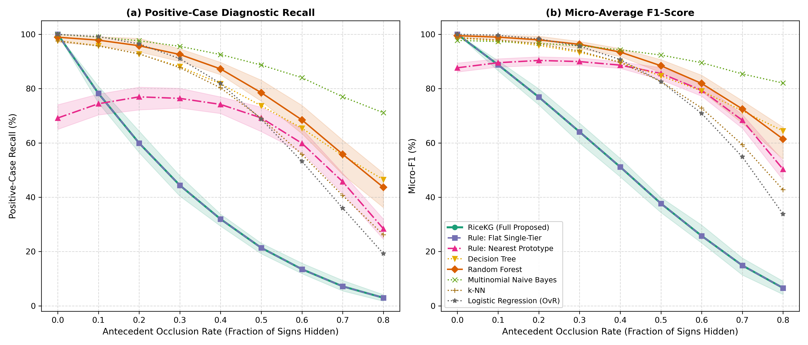
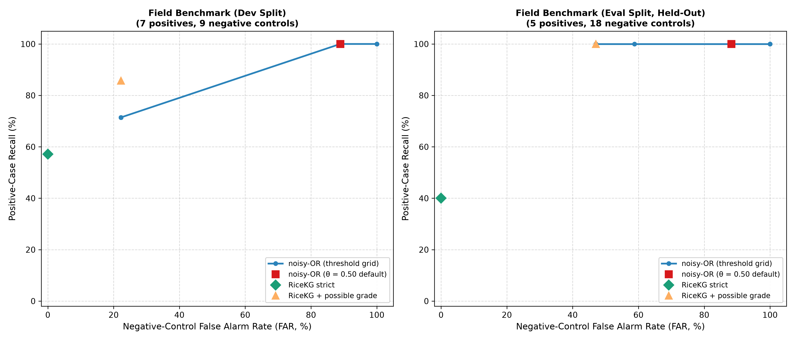

# RiceKG Results

Generated by the scripts in `analysis/` and `baselines/`; each section is rewritten by the script that produces it (the [results index](#results-index) gives the command behind every figure). Structured data for each section is in the matching `results/*.json`.

## Contents

- [Results index (claim, command, source, value)](#results-index)
- [Knowledge-base verification](#kb-verification)
- [Ontology competency questions](#competency-questions)
- [Graded case-level evaluation (field benchmark)](#graded-evaluation)
- [Per-case field failure diagnosis](#field-failure-analysis)
- [Ablation of the architecture](#ablation)
- [Baseline comparison (5x2-fold protocol)](#baselines)
- [Top-k differential diagnosis](#top-k)
- [Observation occlusion degradation](#degradation-curve)
- [Cold-start learning curve](#learning-curve)
- [Probabilistic (noisy-OR) layer](#probabilistic)
- [Expert-based validation](#expert-validation)
- [Archived: locked holdout run (commit 385caf9)](#holdout-archived)

---

<a id="results-index"></a>
<!-- GENERATED FILE — DO NOT EDIT BY HAND -->
<!-- content-sha256: 0d0fe30bbe0a90ed8e82a68f4e395560c6b4022715a51acd574a013b07e9eceb -->
<!-- Regenerate with: python analysis/build_results_index.py -->
<!-- Wired into: make reproduce, CI (check_readme_consistency.py) -->

## Results Index

Auto-generated on 2026-09-19T12:08:06Z from `results/*.json`.
Each row maps a manuscript claim to the command that produces it and the
source artifact that stores the value. Edit
`analysis/build_results_index.py` to change what is indexed.

| Manuscript claim | Command | Source artifact | Value |
|---|---|---|---|
| RiceKG field positive-case recall | `python baselines/run_baselines.py` | `results/baselines.json` | 85.00% |
| RiceKG field exact match | `python baselines/run_baselines.py` | `results/baselines.json` | 95.45% |
| RiceKG field micro-F1 [95% CI] | `python baselines/run_baselines.py` | `results/baselines.json` | 91.14 [77.4, 97.6] |
| Nearest Prototype field positive-case recall | `python baselines/run_baselines.py` | `results/baselines.json` | 40.83% |
| Nearest Prototype field exact match | `python baselines/run_baselines.py` | `results/baselines.json` | 86.36% |
| Nearest Prototype field micro-F1 | `python baselines/run_baselines.py` | `results/baselines.json` | 74.83 |
| RiceKG verification-suite exact match | `python baselines/run_baselines.py` | `results/baselines.json` | 68.51% |
| Field benchmark positive case count | `python baselines/run_baselines.py` | `results/baselines.json` | 5 |
| Field benchmark negative control count | `python baselines/run_baselines.py` | `results/baselines.json` | 17 |
| Decision Tree field positive-recall (5×2-fold CV) | `python baselines/run_baselines.py` | `results/baselines.json` | 0.00% |
| Random Forest field positive-recall (5×2-fold CV) | `python baselines/run_baselines.py` | `results/baselines.json` | 0.00% |
| Multinomial Naive Bayes field positive-recall (5×2-fold CV) | `python baselines/run_baselines.py` | `results/baselines.json` | 0.00% |
| k-NN field positive-recall (5×2-fold CV) | `python baselines/run_baselines.py` | `results/baselines.json` | 0.00% |
| Logistic Regression (OvR) field positive-recall (5×2-fold CV) | `python baselines/run_baselines.py` | `results/baselines.json` | 0.00% |
| Ablation: Pellet vs set matching, identical graded output | `python analysis/ablation.py` | `results/ablation.json` | 129/129 |
| Ablation (dev+eval): RiceKG v2.4.0 (full) committed recall | `python analysis/ablation.py` | `results/ablation.json` | 9/12 |
| Ablation (dev+eval): Without diagnostic-sign rules (R21–R26) committed recall | `python analysis/ablation.py` | `results/ablation.json` | 7/12 |
| Ablation (dev+eval): Tier-1 rules only committed recall | `python analysis/ablation.py` | `results/ablation.json` | 0/12 |
| Ablation (dev+eval): Without out-of-scope gates committed recall | `python analysis/ablation.py` | `results/ablation.json` | 9/12 |
| Ablation (holdout (development-exposed)): RiceKG v2.4.0 (full) committed recall | `python analysis/ablation.py` | `results/ablation.json` | 12/18 |
| Ablation (holdout (development-exposed)): Without diagnostic-sign rules (R21–R26) committed recall | `python analysis/ablation.py` | `results/ablation.json` | 4/18 |
| Ablation (holdout (development-exposed)): Tier-1 rules only committed recall | `python analysis/ablation.py` | `results/ablation.json` | 0/18 |
| Ablation (holdout (development-exposed)): Without out-of-scope gates committed recall | `python analysis/ablation.py` | `results/ablation.json` | 12/18 |
| Ablation (occlusion 0.3): RiceKG v2.4.0 (full) positive recall | `python analysis/ablation.py` | `results/ablation.json` | 67.91% |
| Ablation (occlusion 0.3): Without diagnostic-sign rules (R21–R26) positive recall | `python analysis/ablation.py` | `results/ablation.json` | 44.33% |
| Ablation (occlusion 0.3): Tier-1 rules only positive recall | `python analysis/ablation.py` | `results/ablation.json` | 15.63% |
| Learning-curve crossover detected (Pool A (verification suite)) | `python analysis/learning_curve.py` | `results/learning_curve.json` | None (all test-set CIs include zero) |
| Learning-curve crossover detected (Pool B (field dev)) | `python analysis/learning_curve.py` | `results/learning_curve.json` | None (all test-set CIs include zero) |
| LC zero-shot reference: RiceKG (Full Proposed) positive recall | `python analysis/learning_curve.py` | `results/learning_curve.json` | 85.00% |
| LC zero-shot reference: Rule: Flat Single-Tier positive recall | `python analysis/learning_curve.py` | `results/learning_curve.json` | 85.00% |
| LC zero-shot reference: Rule: Nearest Prototype positive recall | `python analysis/learning_curve.py` | `results/learning_curve.json` | 40.83% |
| RiceKG degradation positive recall at 0.0 occlusion | `python analysis/degradation_curve.py` | `results/degradation_curve.json` | 100.00% |
| RiceKG degradation positive recall at 0.4 occlusion | `python analysis/degradation_curve.py` | `results/degradation_curve.json` | 57.53% |
| RiceKG degradation positive recall at 0.8 occlusion | `python analysis/degradation_curve.py` | `results/degradation_curve.json` | 25.14% |
| RiceKG Top-1 differential hit on field eval | `python analysis/differential_analysis.py` | `results/top_k.json` | 80.00% |
| RiceKG Top-3 differential hit on field eval | `python analysis/differential_analysis.py` | `results/top_k.json` | 100.00% |
| RiceKG Top-k MRR on field eval | `python analysis/differential_analysis.py` | `results/top_k.json` | 0.900 |
| RiceKG Top-3 negative-control specificity on field eval | `python analysis/differential_analysis.py` | `results/top_k.json` | 82.35% |
| Nearest Prototype Top-3 differential hit on field eval | `python analysis/differential_analysis.py` | `results/top_k.json` | 100.00% |
| Flat Single-Tier Top-1 differential hit on field eval | `python analysis/differential_analysis.py` | `results/top_k.json` | 80.00% |
| RiceKG Top-3 differential hit on holdout (tiers A-C) | `python analysis/differential_analysis.py` | `results/top_k.json` | 77.78% |

---
_This file is produced by `analysis/build_results_index.py` and validated by `analysis/check_readme_consistency.py`. A stale or missing index fails the CI build._
<!-- end:results-index -->

<a id="kb-verification"></a>
## Knowledge-Base Verification

> **Generated by**: `analysis/kb_verification.py` on 2026-09-19T01:27:08 UTC.  
> **Scope**: properties of the rule base and ontology that hold independently of any test case.

| Check | Result |
|:---|:---|
| Logical consistency (Pellet) | consistent |
| Reachability | 6/6 in-scope threats have rules |
| Tier-2 ⊆ Tier-1 (confirmed implies suspected) | 6/6 threats |
| Cross-threat subsumption (forced co-diagnosis) | 0 rule pairs |
| Antecedent terms shared by more than one threat | 3 |
| Vocabulary used by rules / gates only / unused | 27 / 24 / 10 of 61 |
| (threat, antecedent) links with a cited source | 31/31 |
| Rules with a literature reference | 18/18 |
| Observation terms with an operational definition | 61/61 |

### Shared antecedents

A term used by several threats cannot discriminate between them on its own.

| Term | Threats using it |
|:---|:---|
| `Uniform_Field_Infection` | Bacterial_Leaf_Blight, False_Smut, Rice_Blast |
| `Stunted_Growth` | Rice_Root_Nematode, Rice_Tungro_Virus |
| `Yellowing_Leaves` | Rice_Root_Nematode, Rice_Tungro_Virus |

### Pairwise rule overlap (Tier-1, Jaccard > 0)

| Threat pair | Shared antecedents | Jaccard |
|:---|:---|:---:|
| Rice_Root_Nematode / Rice_Tungro_Virus | `Stunted_Growth`, `Yellowing_Leaves` | 0.250 |
| Bacterial_Leaf_Blight / Rice_Blast | `Uniform_Field_Infection` | 0.100 |
| False_Smut / Rice_Blast | `Uniform_Field_Infection` | 0.100 |
| Bacterial_Leaf_Blight / False_Smut | `Uniform_Field_Infection` | 0.091 |

### Pairwise rule overlap (Tier-2, Jaccard > 0)

| Threat pair | Shared antecedents | Jaccard |
|:---|:---|:---:|
| Rice_Root_Nematode / Rice_Tungro_Virus | `Stunted_Growth` | 0.200 |

### Vocabulary not used by any rule or gate

These terms can be recorded but never change a diagnosis.

`Bacterial_Ooze`, `Deadheart_Seedling`, `Easily_Pulled_Tillers`, `Empty_Grains`, `Interveinal_Chlorosis`, `Leaf_Mottling`, `Localized_Leaf_Yellowing`, `Plant_Yellowing`, `Random_Feeding_Pattern`, `Rotten_Panicles`
<!-- end:kb-verification -->

<a id="competency-questions"></a>
## Competency Questions

> **Generated by**: `analysis/competency_questions.py` (live SPARQL over the built ontology).  
> **Questions**: 16 — **16 satisfied**, **0 gaps**.

Competency questions follow Gruninger and Fox: the ontology is specified by the questions it must answer, and a question it cannot answer is a finding rather than an omission to be quietly dropped. Every question below is paired with the SPARQL that answers it and is executed by `tests/test_competency_questions.py`, which fails if a declared status stops matching the ontology — including when a gap is closed without this document being updated.

Namespace: `http://www.semanticweb.org/ontologies/rice_pest_disease.owl#`

### Summary

| ID | Question | Status |
|:--|:--|:--|
| `CQ01` | Which phenotypic symptoms does the ontology model? | satisfied |
| `CQ02` | Which biotic threats does the ontology model? | satisfied |
| `CQ03` | Which of the modelled threats are pests (after the insect scope cut, the plant-parasitic nematode)? | satisfied |
| `CQ04` | Which of the modelled threats are pathogen-caused diseases? | satisfied |
| `CQ05` | Is every pest and every disease also classified as a threat? | satisfied |
| `CQ06` | Does the ontology distinguish a confirmed diagnosis from a suspected one? | satisfied |
| `CQ07` | Do the graded diagnosis properties specialise the general hasThreat property, so that existing queries still resolve? | satisfied |
| `CQ08` | Which control treatment is recommended for a diagnosed threat? | satisfied |
| `CQ09` | What diagnostic confidence does the ontology attach to an inferred threat? | satisfied |
| `CQ10` | Which symptoms are the antecedents of the rule that diagnoses a given threat? | satisfied |
| `CQ11` | Given a complete pathognomonic observation, which threat is confirmed? | satisfied |
| `CQ12` | Given only a partial observation, which threat is raised as suspected? | satisfied |
| `CQ13` | Does a partial observation avoid asserting a confirmed diagnosis? | satisfied |
| `CQ14` | Which symptoms were observed on the sample under diagnosis? | satisfied |
| `CQ15` | When two threats are present at once, are both inferred? | satisfied |
| `CQ16` | With no symptom observed, does the reasoner correctly assert no threat? | satisfied |

### Questions and queries

#### CQ01 — Which phenotypic symptoms does the ontology model?

- **Status**: satisfied
- **Scenario**: schema only (no sample)
- **Result**: `46`

```sparql
PREFIX : <http://www.semanticweb.org/ontologies/rice_pest_disease.owl#>
PREFIX rdfs: <http://www.w3.org/2000/01/rdf-schema#>
SELECT (COUNT(DISTINCT ?s) AS ?n) WHERE { ?s a :Symptom . }
```

#### CQ02 — Which biotic threats does the ontology model?

- **Status**: satisfied
- **Scenario**: schema only (no sample)
- **Result**: `6`

```sparql
PREFIX : <http://www.semanticweb.org/ontologies/rice_pest_disease.owl#>
PREFIX rdfs: <http://www.w3.org/2000/01/rdf-schema#>
SELECT (COUNT(DISTINCT ?t) AS ?n) WHERE { ?t a/rdfs:subClassOf* :Threat . }
```

#### CQ03 — Which of the modelled threats are pests (after the insect scope cut, the plant-parasitic nematode)?

- **Status**: satisfied
- **Scenario**: schema only (no sample)
- **Result**: 1 result(s): `Rice_Root_Nematode`

```sparql
PREFIX : <http://www.semanticweb.org/ontologies/rice_pest_disease.owl#>
PREFIX rdfs: <http://www.w3.org/2000/01/rdf-schema#>
SELECT ?p WHERE { ?p a :Pest . }
```

#### CQ04 — Which of the modelled threats are pathogen-caused diseases?

- **Status**: satisfied
- **Scenario**: schema only (no sample)
- **Result**: 5 result(s): `Bacterial_Leaf_Blight`, `False_Smut`, `Rice_Blast`, `Rice_Grassy_Stunt`, `Rice_Tungro_Virus`

```sparql
PREFIX : <http://www.semanticweb.org/ontologies/rice_pest_disease.owl#>
PREFIX rdfs: <http://www.w3.org/2000/01/rdf-schema#>
SELECT ?d WHERE { ?d a :Disease . }
```

#### CQ05 — Is every pest and every disease also classified as a threat?

- **Status**: satisfied
- **Scenario**: schema only (no sample)
- **Result**: `6`

```sparql
PREFIX : <http://www.semanticweb.org/ontologies/rice_pest_disease.owl#>
PREFIX rdfs: <http://www.w3.org/2000/01/rdf-schema#>
SELECT (COUNT(?x) AS ?n) WHERE { ?x a/rdfs:subClassOf* :Threat . { ?x a :Pest . } UNION { ?x a :Disease . } }
```

#### CQ06 — Does the ontology distinguish a confirmed diagnosis from a suspected one?

- **Status**: satisfied
- **Scenario**: schema only (no sample)
- **Result**: 2 result(s): `hasConfirmedThreat`, `hasSuspectedThreat`

```sparql
PREFIX : <http://www.semanticweb.org/ontologies/rice_pest_disease.owl#>
PREFIX rdfs: <http://www.w3.org/2000/01/rdf-schema#>
SELECT ?p WHERE { VALUES ?p { :hasConfirmedThreat :hasSuspectedThreat } ?p a <http://www.w3.org/2002/07/owl#ObjectProperty> . }
```

#### CQ07 — Do the graded diagnosis properties specialise the general hasThreat property, so that existing queries still resolve?

- **Status**: satisfied
- **Scenario**: schema only (no sample)
- **Result**: 2 result(s): `hasConfirmedThreat`, `hasSuspectedThreat`

```sparql
PREFIX : <http://www.semanticweb.org/ontologies/rice_pest_disease.owl#>
PREFIX rdfs: <http://www.w3.org/2000/01/rdf-schema#>
SELECT ?p WHERE { ?p rdfs:subPropertyOf :hasThreat . VALUES ?p { :hasConfirmedThreat :hasSuspectedThreat } }
```

#### CQ08 — Which control treatment is recommended for a diagnosed threat?

- **Status**: satisfied
- **Scenario**: schema only (no sample)
- **Result**: `6`

```sparql
PREFIX : <http://www.semanticweb.org/ontologies/rice_pest_disease.owl#>
PREFIX rdfs: <http://www.w3.org/2000/01/rdf-schema#>
SELECT (COUNT(?c) AS ?n) WHERE { ?t a/rdfs:subClassOf* :Threat . ?t :hasControlTreatment ?c . ?c a :ControlTreatment . }
```

#### CQ09 — What diagnostic confidence does the ontology attach to an inferred threat?

- **Status**: satisfied
- **Scenario**: schema only (no sample)
- **Result**: `1`

```sparql
PREFIX : <http://www.semanticweb.org/ontologies/rice_pest_disease.owl#>
PREFIX rdfs: <http://www.w3.org/2000/01/rdf-schema#>
SELECT (COUNT(?p) AS ?n) WHERE { ?p a <http://www.w3.org/2002/07/owl#DatatypeProperty> . }
```

#### CQ10 — Which symptoms are the antecedents of the rule that diagnoses a given threat?

- **Status**: satisfied
- **Scenario**: schema only (no sample)
- **Result**: `31`

```sparql
PREFIX : <http://www.semanticweb.org/ontologies/rice_pest_disease.owl#>
PREFIX rdfs: <http://www.w3.org/2000/01/rdf-schema#>
SELECT (COUNT(?s) AS ?n) WHERE { ?t a/rdfs:subClassOf* :Threat . ?t :hasSymptom ?s . }
```

#### CQ11 — Given a complete pathognomonic observation, which threat is confirmed?

- **Status**: satisfied
- **Scenario**: canonical_blast
- **Result**: 1 result(s): `Rice_Blast`

```sparql
PREFIX : <http://www.semanticweb.org/ontologies/rice_pest_disease.owl#>
PREFIX rdfs: <http://www.w3.org/2000/01/rdf-schema#>
SELECT ?t WHERE { ?r a :Rice . ?r :hasConfirmedThreat ?t . }
```

#### CQ12 — Given only a partial observation, which threat is raised as suspected?

- **Status**: satisfied
- **Scenario**: partial_smut
- **Result**: 1 result(s): `False_Smut`

```sparql
PREFIX : <http://www.semanticweb.org/ontologies/rice_pest_disease.owl#>
PREFIX rdfs: <http://www.w3.org/2000/01/rdf-schema#>
SELECT ?t WHERE { ?r a :Rice . ?r :hasSuspectedThreat ?t . }
```

#### CQ13 — Does a partial observation avoid asserting a confirmed diagnosis?

- **Status**: satisfied
- **Scenario**: partial_smut
- **Result**: `0`

```sparql
PREFIX : <http://www.semanticweb.org/ontologies/rice_pest_disease.owl#>
PREFIX rdfs: <http://www.w3.org/2000/01/rdf-schema#>
SELECT (COUNT(?t) AS ?n) WHERE { ?r a :Rice . ?r :hasConfirmedThreat ?t . }
```

#### CQ14 — Which symptoms were observed on the sample under diagnosis?

- **Status**: satisfied
- **Scenario**: canonical_blast
- **Result**: 3 result(s): `Diamond_Shaped_Lesions`, `Necrotic_Spots`, `Panicle_Neck_Rot`

```sparql
PREFIX : <http://www.semanticweb.org/ontologies/rice_pest_disease.owl#>
PREFIX rdfs: <http://www.w3.org/2000/01/rdf-schema#>
SELECT ?s WHERE { ?r a :Rice . ?r :hasSymptom ?s . }
```

#### CQ15 — When two threats are present at once, are both inferred?

- **Status**: satisfied
- **Scenario**: co_infection
- **Result**: `2`

```sparql
PREFIX : <http://www.semanticweb.org/ontologies/rice_pest_disease.owl#>
PREFIX rdfs: <http://www.w3.org/2000/01/rdf-schema#>
SELECT (COUNT(DISTINCT ?t) AS ?n) WHERE { ?r a :Rice . ?r :hasThreat ?t . }
```

#### CQ16 — With no symptom observed, does the reasoner correctly assert no threat?

- **Status**: satisfied
- **Scenario**: empty
- **Result**: `0`

```sparql
PREFIX : <http://www.semanticweb.org/ontologies/rice_pest_disease.owl#>
PREFIX rdfs: <http://www.w3.org/2000/01/rdf-schema#>
SELECT (COUNT(?t) AS ?n) WHERE { ?r a :Rice . ?r :hasThreat ?t . }
```
<!-- end:competency-questions -->

<a id="graded-evaluation"></a>
## Graded Case-Level Evaluation (Field Benchmark)

> **Generated by**: `analysis/graded_evaluation.py` on 2026-09-19T01:29:25 UTC.  
> **Protocol**: every system runs once on every case; no training and no cross-validation. Figures are counts over cases with exact Clopper–Pearson 95% intervals.  
> **Independence**: `eval` is development-informed and `holdout` is development-exposed because the rule base was revised after they were seen; neither is a strictly held-out estimate.

Outcome categories are defined in the script docstring. *Committed* means graded confirmed or suspected; a **misfire** names the wrong disease and is the harmful error, while abstaining or rejecting as out of scope is a safe failure.

### eval (5 positive cases, 17 negative controls)

| System | Committed recall | Recall incl. `possible` | Misfire | Committed precision | False alarm (controls) | Explicit rejection (controls) |
|:---|:---:|:---:|:---:|:---:|:---:|:---:|
| RiceKG strict | 4/5 (80.0%) [28.4, 99.5] | 4/5 (80.0%) [28.4, 99.5] | 0/5 (0.0%) [0.0, 52.2] | 4/4 (100.0%) [39.8, 100.0] | 0/17 (0.0%) [0.0, 19.5] | 11/17 (64.7%) [38.3, 85.8] |
| RiceKG + possible | 4/5 (80.0%) [28.4, 99.5] | 5/5 (100.0%) [47.8, 100.0] | 0/5 (0.0%) [0.0, 52.2] | 4/4 (100.0%) [39.8, 100.0] | 0/17 (0.0%) [0.0, 19.5] | 11/17 (64.7%) [38.3, 85.8] |
| Flat single-tier rules | 4/5 (80.0%) [28.4, 99.5] | 4/5 (80.0%) [28.4, 99.5] | 0/5 (0.0%) [0.0, 52.2] | 4/4 (100.0%) [39.8, 100.0] | 0/17 (0.0%) [0.0, 19.5] | 0/17 (0.0%) [0.0, 19.5] |
| Nearest prototype | 4/5 (80.0%) [28.4, 99.5] | 4/5 (80.0%) [28.4, 99.5] | 0/5 (0.0%) [0.0, 52.2] | 4/6 (66.7%) [22.3, 95.7] | 0/17 (0.0%) [0.0, 19.5] | 0/17 (0.0%) [0.0, 19.5] |

Positive-case outcomes:

| System | correct | misfire | possible_hit | possible_miss | rejected | abstain |
|:---|:---:|:---:|:---:|:---:|:---:|:---:|
| RiceKG strict | 4 | 0 | 0 | 0 | 0 | 1 |
| RiceKG + possible | 4 | 0 | 1 | 0 | 0 | 0 |
| Flat single-tier rules | 4 | 0 | 0 | 0 | 0 | 1 |
| Nearest prototype | 4 | 0 | 0 | 0 | 0 | 1 |

Negative-control outcomes:

| System | false_alarm | possible_alarm | explicit_rejection | silent_abstention |
|:---|:---:|:---:|:---:|:---:|
| RiceKG strict | 0 | 0 | 11 | 6 |
| RiceKG + possible | 0 | 3 | 11 | 3 |
| Flat single-tier rules | 0 | 0 | 0 | 17 |
| Nearest prototype | 0 | 0 | 0 | 17 |

RiceKG precision by confidence grade (grades are valid if precision falls as the grade weakens): `suspected` 4/4 (100.0%) [39.8, 100.0]; `possible` 1/5 (20.0%) [0.5, 71.6].

Paired exact McNemar against RiceKG strict (per-case success):

| Comparator | Only RiceKG strict correct | Only comparator correct | p |
|:---|:---:|:---:|:---:|
| RiceKG + possible | 0 | 0 | 1.0000 |
| Flat single-tier rules | 0 | 0 | 1.0000 |
| Nearest prototype | 0 | 0 | 1.0000 |

### dev (7 positive cases, 9 negative controls)

| System | Committed recall | Recall incl. `possible` | Misfire | Committed precision | False alarm (controls) | Explicit rejection (controls) |
|:---|:---:|:---:|:---:|:---:|:---:|:---:|
| RiceKG strict | 5/7 (71.4%) [29.0, 96.3] | 5/7 (71.4%) [29.0, 96.3] | 0/7 (0.0%) [0.0, 41.0] | 5/5 (100.0%) [47.8, 100.0] | 0/9 (0.0%) [0.0, 33.6] | 3/9 (33.3%) [7.5, 70.1] |
| RiceKG + possible | 5/7 (71.4%) [29.0, 96.3] | 6/7 (85.7%) [42.1, 99.6] | 0/7 (0.0%) [0.0, 41.0] | 5/5 (100.0%) [47.8, 100.0] | 0/9 (0.0%) [0.0, 33.6] | 3/9 (33.3%) [7.5, 70.1] |
| Flat single-tier rules | 5/7 (71.4%) [29.0, 96.3] | 5/7 (71.4%) [29.0, 96.3] | 0/7 (0.0%) [0.0, 41.0] | 5/5 (100.0%) [47.8, 100.0] | 0/9 (0.0%) [0.0, 33.6] | 0/9 (0.0%) [0.0, 33.6] |
| Nearest prototype | 4/7 (57.1%) [18.4, 90.1] | 4/7 (57.1%) [18.4, 90.1] | 0/7 (0.0%) [0.0, 41.0] | 4/4 (100.0%) [39.8, 100.0] | 0/9 (0.0%) [0.0, 33.6] | 0/9 (0.0%) [0.0, 33.6] |

Positive-case outcomes:

| System | correct | misfire | possible_hit | possible_miss | rejected | abstain |
|:---|:---:|:---:|:---:|:---:|:---:|:---:|
| RiceKG strict | 5 | 0 | 0 | 0 | 0 | 2 |
| RiceKG + possible | 5 | 0 | 1 | 0 | 0 | 1 |
| Flat single-tier rules | 5 | 0 | 0 | 0 | 0 | 2 |
| Nearest prototype | 4 | 0 | 0 | 0 | 0 | 3 |

Negative-control outcomes:

| System | false_alarm | possible_alarm | explicit_rejection | silent_abstention |
|:---|:---:|:---:|:---:|:---:|
| RiceKG strict | 0 | 0 | 3 | 6 |
| RiceKG + possible | 0 | 2 | 3 | 4 |
| Flat single-tier rules | 0 | 0 | 0 | 9 |
| Nearest prototype | 0 | 0 | 0 | 9 |

RiceKG precision by confidence grade (grades are valid if precision falls as the grade weakens): `suspected` 5/5 (100.0%) [47.8, 100.0]; `possible` 1/4 (25.0%) [0.6, 80.6].

Paired exact McNemar against RiceKG strict (per-case success):

| Comparator | Only RiceKG strict correct | Only comparator correct | p |
|:---|:---:|:---:|:---:|
| RiceKG + possible | 0 | 0 | 1.0000 |
| Flat single-tier rules | 0 | 0 | 1.0000 |
| Nearest prototype | 1 | 0 | 1.0000 |

### dev+eval (12 positive cases, 26 negative controls)

| System | Committed recall | Recall incl. `possible` | Misfire | Committed precision | False alarm (controls) | Explicit rejection (controls) |
|:---|:---:|:---:|:---:|:---:|:---:|:---:|
| RiceKG strict | 9/12 (75.0%) [42.8, 94.5] | 9/12 (75.0%) [42.8, 94.5] | 0/12 (0.0%) [0.0, 26.5] | 9/9 (100.0%) [66.4, 100.0] | 0/26 (0.0%) [0.0, 13.2] | 14/26 (53.9%) [33.4, 73.4] |
| RiceKG + possible | 9/12 (75.0%) [42.8, 94.5] | 11/12 (91.7%) [61.5, 99.8] | 0/12 (0.0%) [0.0, 26.5] | 9/9 (100.0%) [66.4, 100.0] | 0/26 (0.0%) [0.0, 13.2] | 14/26 (53.9%) [33.4, 73.4] |
| Flat single-tier rules | 9/12 (75.0%) [42.8, 94.5] | 9/12 (75.0%) [42.8, 94.5] | 0/12 (0.0%) [0.0, 26.5] | 9/9 (100.0%) [66.4, 100.0] | 0/26 (0.0%) [0.0, 13.2] | 0/26 (0.0%) [0.0, 13.2] |
| Nearest prototype | 8/12 (66.7%) [34.9, 90.1] | 8/12 (66.7%) [34.9, 90.1] | 0/12 (0.0%) [0.0, 26.5] | 8/10 (80.0%) [44.4, 97.5] | 0/26 (0.0%) [0.0, 13.2] | 0/26 (0.0%) [0.0, 13.2] |

Positive-case outcomes:

| System | correct | misfire | possible_hit | possible_miss | rejected | abstain |
|:---|:---:|:---:|:---:|:---:|:---:|:---:|
| RiceKG strict | 9 | 0 | 0 | 0 | 0 | 3 |
| RiceKG + possible | 9 | 0 | 2 | 0 | 0 | 1 |
| Flat single-tier rules | 9 | 0 | 0 | 0 | 0 | 3 |
| Nearest prototype | 8 | 0 | 0 | 0 | 0 | 4 |

Negative-control outcomes:

| System | false_alarm | possible_alarm | explicit_rejection | silent_abstention |
|:---|:---:|:---:|:---:|:---:|
| RiceKG strict | 0 | 0 | 14 | 12 |
| RiceKG + possible | 0 | 5 | 14 | 7 |
| Flat single-tier rules | 0 | 0 | 0 | 26 |
| Nearest prototype | 0 | 0 | 0 | 26 |

RiceKG precision by confidence grade (grades are valid if precision falls as the grade weakens): `suspected` 9/9 (100.0%) [66.4, 100.0]; `possible` 2/9 (22.2%) [2.8, 60.0].

Paired exact McNemar against RiceKG strict (per-case success):

| Comparator | Only RiceKG strict correct | Only comparator correct | p |
|:---|:---:|:---:|:---:|
| RiceKG + possible | 0 | 0 | 1.0000 |
| Flat single-tier rules | 0 | 0 | 1.0000 |
| Nearest prototype | 1 | 0 | 1.0000 |

### holdout (development-exposed) (18 positive cases, 0 negative controls)

| System | Committed recall | Recall incl. `possible` | Misfire | Committed precision | False alarm (controls) | Explicit rejection (controls) |
|:---|:---:|:---:|:---:|:---:|:---:|:---:|
| RiceKG strict | 12/18 (66.7%) [41.0, 86.7] | 12/18 (66.7%) [41.0, 86.7] | 1/18 (5.6%) [0.1, 27.3] | 12/13 (92.3%) [64.0, 99.8] | — | — |
| RiceKG + possible | 12/18 (66.7%) [41.0, 86.7] | 14/18 (77.8%) [52.4, 93.6] | 1/18 (5.6%) [0.1, 27.3] | 12/13 (92.3%) [64.0, 99.8] | — | — |
| Flat single-tier rules | 12/18 (66.7%) [41.0, 86.7] | 12/18 (66.7%) [41.0, 86.7] | 1/18 (5.6%) [0.1, 27.3] | 12/13 (92.3%) [64.0, 99.8] | — | — |
| Nearest prototype | 7/18 (38.9%) [17.3, 64.3] | 7/18 (38.9%) [17.3, 64.3] | 2/18 (11.1%) [1.4, 34.7] | 7/11 (63.6%) [30.8, 89.1] | — | — |

Positive-case outcomes:

| System | correct | misfire | possible_hit | possible_miss | rejected | abstain |
|:---|:---:|:---:|:---:|:---:|:---:|:---:|
| RiceKG strict | 12 | 1 | 0 | 0 | 0 | 5 |
| RiceKG + possible | 12 | 1 | 2 | 2 | 0 | 1 |
| Flat single-tier rules | 12 | 1 | 0 | 0 | 0 | 5 |
| Nearest prototype | 7 | 2 | 0 | 0 | 0 | 9 |

RiceKG precision by confidence grade (grades are valid if precision falls as the grade weakens): `suspected` 12/13 (92.3%) [64.0, 99.8]; `possible` 2/6 (33.3%) [4.3, 77.7].

Paired exact McNemar against RiceKG strict (per-case success):

| Comparator | Only RiceKG strict correct | Only comparator correct | p |
|:---|:---:|:---:|:---:|
| RiceKG + possible | 0 | 0 | 1.0000 |
| Flat single-tier rules | 0 | 0 | 1.0000 |
| Nearest prototype | 6 | 1 | 0.1250 |

### Per-case outcomes

| Case | Split | Truth | RiceKG | RiceKG output |
|:---|:---|:---|:---|:---|
| FIELD_01 | dev | Rice_Blast | possible_hit | Rice_Blast (possible), Bacterial_Leaf_Blight (possible) |
| FIELD_02 | dev | Rice_Blast | abstain | — |
| FIELD_03 | dev | Bacterial_Leaf_Blight | correct | Bacterial_Leaf_Blight (suspected) |
| FIELD_04 | dev | Rice_Root_Nematode | correct | Rice_Root_Nematode (suspected) |
| FIELD_05 | dev | False_Smut | correct | False_Smut (suspected) |
| FIELD_06 | dev | No_Diagnosis | explicit_rejection | signs recorded, not consistent with any disease in scope (out_of_scope) |
| FIELD_07 | dev | No_Diagnosis | explicit_rejection | signs recorded, not consistent with any disease in scope (out_of_scope) |
| FIELD_08 | dev | No_Diagnosis | silent_abstention | — |
| FIELD_09 | dev | No_Diagnosis | silent_abstention | — |
| FIELD_10 | dev | No_Diagnosis | silent_abstention | — |
| FIELD_11 | dev | No_Diagnosis | explicit_rejection | signs recorded, not consistent with any disease in scope (out_of_scope) |
| FIELD_12 | dev | No_Diagnosis | silent_abstention | — |
| FIELD_13 | dev | No_Diagnosis | possible_alarm | Rice_Blast (possible) |
| FIELD_14 | dev | No_Diagnosis | possible_alarm | Rice_Blast (possible) |
| FIELD_33 | dev | Rice_Root_Nematode | correct | Rice_Root_Nematode (suspected) |
| FIELD_35 | dev | Bacterial_Leaf_Blight | correct | Bacterial_Leaf_Blight (suspected) |
| FIELD_15 | eval | No_Diagnosis | silent_abstention | — |
| FIELD_16 | eval | No_Diagnosis | explicit_rejection | signs recorded, not consistent with any disease in scope (out_of_scope) |
| FIELD_17 | eval | No_Diagnosis | possible_alarm | Rice_Tungro_Virus (possible) |
| FIELD_18 | eval | No_Diagnosis | explicit_rejection | signs recorded, not consistent with any disease in scope (out_of_scope) |
| FIELD_19 | eval | No_Diagnosis | explicit_rejection | signs recorded, not consistent with any disease in scope (out_of_scope) |
| FIELD_20 | eval | No_Diagnosis | explicit_rejection | signs recorded, not consistent with any disease in scope (out_of_scope) |
| FIELD_21 | eval | No_Diagnosis | explicit_rejection | signs recorded, not consistent with any disease in scope (out_of_scope) |
| FIELD_22 | eval | No_Diagnosis | explicit_rejection | signs recorded, not consistent with any disease in scope (out_of_scope) |
| FIELD_23 | eval | No_Diagnosis | explicit_rejection | signs recorded, not consistent with any disease in scope (out_of_scope) |
| FIELD_25 | eval | No_Diagnosis | explicit_rejection | signs recorded, not consistent with any disease in scope (out_of_scope) |
| FIELD_26 | eval | No_Diagnosis | explicit_rejection | signs recorded, not consistent with any disease in scope (out_of_scope) |
| FIELD_27 | eval | No_Diagnosis | silent_abstention | — |
| FIELD_28 | eval | No_Diagnosis | possible_alarm | Rice_Blast (possible) |
| FIELD_29 | eval | No_Diagnosis | explicit_rejection | signs recorded, not consistent with any disease in scope (out_of_scope) |
| FIELD_30 | eval | No_Diagnosis | silent_abstention | — |
| FIELD_31 | eval | No_Diagnosis | explicit_rejection | signs recorded, not consistent with any disease in scope (out_of_scope) |
| FIELD_32 | eval | No_Diagnosis | possible_alarm | Bacterial_Leaf_Blight (possible) |
| FIELD_34 | eval | Rice_Root_Nematode | correct | Rice_Root_Nematode (suspected) |
| FIELD_36 | eval | Bacterial_Leaf_Blight | correct | Bacterial_Leaf_Blight (suspected) |
| FIELD_51 | eval | Rice_Tungro_Virus | possible_hit | Rice_Tungro_Virus (possible), Rice_Grassy_Stunt (possible) |
| FIELD_52 | eval | Rice_Tungro_Virus | correct | Rice_Tungro_Virus (suspected) |
| FIELD_53 | eval | Rice_Grassy_Stunt | correct | Rice_Grassy_Stunt (suspected) |
| HOLD_01 | holdout | Bacterial_Leaf_Blight | correct | Bacterial_Leaf_Blight (suspected) |
| HOLD_02 | holdout | Rice_Root_Nematode | correct | Rice_Root_Nematode (suspected) |
| HOLD_03 | holdout | False_Smut | correct | False_Smut (suspected) |
| HOLD_04 | holdout | Rice_Grassy_Stunt | misfire | Rice_Tungro_Virus (suspected) |
| HOLD_05 | holdout | Rice_Grassy_Stunt | possible_miss | Rice_Root_Nematode (possible), Rice_Tungro_Virus (possible) |
| HOLD_06 | holdout | Rice_Tungro_Virus | abstain | — |
| HOLD_07 | holdout | Rice_Blast | correct | Rice_Blast (suspected) |
| HOLD_08 | holdout | Rice_Blast | correct | Rice_Blast (suspected) |
| HOLD_09 | holdout | False_Smut | correct | False_Smut (suspected) |
| HOLD_10 | holdout | Rice_Root_Nematode | correct | Rice_Root_Nematode (suspected) |
| HOLD_11 | holdout | Rice_Blast | correct | Rice_Blast (suspected) |
| HOLD_12 | holdout | False_Smut | correct | False_Smut (suspected) |
| HOLD_13 | holdout | Bacterial_Leaf_Blight | possible_hit | Bacterial_Leaf_Blight (possible) |
| HOLD_14 | holdout | Rice_Tungro_Virus | possible_miss | Rice_Grassy_Stunt (possible), Rice_Blast (possible) |
| HOLD_15 | holdout | False_Smut | correct | False_Smut (suspected) |
| HOLD_16 | holdout | Rice_Tungro_Virus | possible_hit | Rice_Tungro_Virus (possible) |
| HOLD_18 | holdout | Rice_Blast | correct | Rice_Blast (suspected) |
| HOLD_20 | holdout | Rice_Root_Nematode | correct | Rice_Root_Nematode (suspected) |
<!-- end:graded-evaluation -->

<a id="field-failure-analysis"></a>
## Per-Case Failure Diagnosis: Positive Field Benchmark Cases (BENCHMARK Split)

> **Generated by**: `analysis/field_failure_analysis.py` (live reasoner output).  
> **Benchmark**: `data/benchmark_field.csv` (split `benchmark`) — 38 cases: 12 in-scope disease cases, 26 out-of-scope negative controls.  
> **Positive-case recall**: **9/12** (75.0%).

### Identifier normalization

Symptom identifiers in this benchmark were originally recorded in a descriptive snake_case namespace (`seed_yellowish_green_velvety_balls`) that shares no terms with the ontology vocabulary `model.ALL_SYMPTOMS` (`Rusty_Grain_Balls`). None of the 25 recorded descriptors matched, so every case reached the reasoner as an empty assertion set and the benchmark could not exercise the rule base at all. `data/symptom_mapping.csv` records the resolution of each descriptor: **22 mapped** to an ontology term and **12 left unmapped** because the ontology models no corresponding concept. The unmapped descriptors are retained per case in the `unmapped_terms` column so the vocabulary gap stays auditable.

### Failure causes

| Cause | Meaning | Remedy |
|:--|:--|:--|
| `resolved` | RiceKG predicts the true label. | — |
| `vocabulary_gating` | No symptom maps; reasoner receives an empty input. | Ontology extension |
| `partial_vocabulary` | Some symptoms map, some dropped, no rule fires. | Ontology extension |
| `rule_recall_failure` | All symptoms map, yet no rule fires. | Rule revision |
| `misfire` | A rule fires on the wrong threat. | Rule revision |

### Summary matrix

| Case | Split | True Label | Mapped Symptoms | Dropped Descriptors | Rules Fired | Predicted | Cause |
|:--|:--|:--|:--|:--|:--|:--|:--|
| **FIELD_01** | `dev` | `Rice_Blast` | `Necrotic_Spots`, `Water_Soaked_Lesions` | `leaves_discoloration` | *none* | `No_Diagnosis` | **`partial_vocabulary`** |
| **FIELD_02** | `dev` | `Rice_Blast` | `Empty_Grains`, `Panicle_Neck_Rot` | *none* | *none* | `No_Diagnosis` | **`rule_recall_failure`** |
| **FIELD_03** | `dev` | `Bacterial_Leaf_Blight` | `Yellowing_Leaf_Veins`, `Leaf_Discoloration_Yellow`, `Yellowing_Leaf_Tips`, `Water_Soaked_Lesions`, `Bacterial_Ooze`, `Leaf_Desiccation` | `leaves_drying_up_yellowish_brown` | SWRL-R16 | Bacterial_Leaf_Blight | **`resolved`** |
| **FIELD_04** | `dev` | `Rice_Root_Nematode` | `Hook_Like_Root_Swelling`, `Infected_Seedlings` | *none* | SWRL-R21 | Rice_Root_Nematode | **`resolved`** |
| **FIELD_05** | `dev` | `False_Smut` | `Rusty_Grain_Balls`, `Blackened_Grain_Balls` | *none* | SWRL-R17, SWRL-R24, SWRL-R25 | False_Smut | **`resolved`** |
| **FIELD_33** | `dev` | `Rice_Root_Nematode` | `Hook_Like_Root_Swelling`, `Yellowing_Leaves` | *none* | SWRL-R21 | Rice_Root_Nematode | **`resolved`** |
| **FIELD_34** | `eval` | `Rice_Root_Nematode` | `Hook_Like_Root_Swelling`, `Yellowing_Leaves`, `Stunted_Growth` | *none* | SWRL-R12, SWRL-R21 | Rice_Root_Nematode | **`resolved`** |
| **FIELD_35** | `dev` | `Bacterial_Leaf_Blight` | `Leaf_Discoloration_Yellow`, `Yellowing_Leaf_Tips`, `Water_Soaked_Lesions` | *none* | SWRL-R16 | Bacterial_Leaf_Blight | **`resolved`** |
| **FIELD_36** | `eval` | `Bacterial_Leaf_Blight` | `Leaf_Discoloration_Yellow`, `Yellowing_Leaf_Tips`, `Water_Soaked_Lesions` | *none* | SWRL-R16 | Bacterial_Leaf_Blight | **`resolved`** |
| **FIELD_51** | `eval` | `Rice_Tungro_Virus` | `Severe_Stunting`, `Orange_Leaf_Discoloration` | *none* | *none* | `No_Diagnosis` | **`rule_recall_failure`** |
| **FIELD_52** | `eval` | `Rice_Tungro_Virus` | `Yellowing_Leaves`, `Stunted_Growth`, `Green_Leafhopper_Present`, `Orange_Leaf_Discoloration` | *none* | SWRL-R20 | Rice_Tungro_Virus | **`resolved`** |
| **FIELD_53** | `eval` | `Rice_Grassy_Stunt` | `Yellowing_Leaves`, `Severe_Stunting`, `Excessive_Tillering` | *none* | SWRL-R19, SWRL-R23 | Rice_Grassy_Stunt | **`resolved`** |

### Per-case detail

#### FIELD_01 — `Rice_Blast`

- **Source**: You et al. (2012). First Report of Rice Blast (Magnaporthe oryzae) on Rice (Oryza sativa) in Western Australia. Plant Disease, 96(8): 1228-1228.
- **DOI**: [10.1094/pdis-05-12-0420-pdn](https://doi.org/10.1094/pdis-05-12-0420-pdn)
- **Verbatim symptom text**: "A leaf spot symptom initially appeared as grey-green and/or water soaked with a darker green border and then expanded rapidly to several centimeters in length and became light tan in color with a distinct necrotic border."
- **Mapped into ontology**: `Necrotic_Spots`, `Water_Soaked_Lesions`
- **Dropped (no ontology term)**: `leaves_discoloration`
- **Inferred**: no threat; reasoner returned `No_Diagnosis`
- **Failure cause**: **`partial_vocabulary`**

#### FIELD_02 — `Rice_Blast`

- **Source**: Greer et al. (1997). First Report of Rice Blast Caused by Pyricularia grisea in California. Plant Disease, 81(9): 1094-1094.
- **DOI**: [10.1094/pdis.1997.81.9.1094a](https://doi.org/10.1094/pdis.1997.81.9.1094a)
- **Verbatim symptom text**: "Symptoms observed in commercial fields during September and October consisted mainly of darkened lesions at the panicle neck node and flag leaf collar. Many of the panicles with neck rot were partially filled or blank."
- **Mapped into ontology**: `Empty_Grains`, `Panicle_Neck_Rot`
- **Dropped (no ontology term)**: *none*
- **Inferred**: no threat; reasoner returned `No_Diagnosis`
- **Failure cause**: **`rule_recall_failure`**

#### FIELD_03 — `Bacterial_Leaf_Blight`

- **Source**: Raveloson et al. (2023). First Report of Bacterial Leaf Blight Disease of Rice Caused by Xanthomonas oryzae pv. oryzae in Madagascar. Plant Disease, 107(8): 2510.
- **DOI**: [10.1094/pdis-03-23-0411-pdn](https://doi.org/10.1094/pdis-03-23-0411-pdn)
- **Verbatim symptom text**: "Typical symptoms were characterized by yellow to grayish, water-soaked lesions that start from the leaf tip and progress along the central vein or leaf margin. At an advanced stage of the disease, the leaves were completely desiccated sometimes with droplets of yellow exudate at the leaf margin."
- **Mapped into ontology**: `Yellowing_Leaf_Veins`, `Leaf_Discoloration_Yellow`, `Yellowing_Leaf_Tips`, `Water_Soaked_Lesions`, `Bacterial_Ooze`, `Leaf_Desiccation`
- **Dropped (no ontology term)**: `leaves_drying_up_yellowish_brown`
- **Inferred**: `Bacterial_Leaf_Blight` (grade `suspected`, confidence 0.9714, antecedent coverage 0.6667) via SWRL-R16
- **Unmet antecedents**: `Rapid_Disease_Spread`, `Uniform_Field_Infection`
- **Failure cause**: **`resolved`**

#### FIELD_04 — `Rice_Root_Nematode`

- **Source**: Xie et al. (2019). First Report of Root-Knot Nematode, Meloidogyne graminicola, on Rice in Sichuan Province, Southwest China. Plant Disease, 103(8): 2142-2142.
- **DOI**: [10.1094/pdis-03-19-0502-pdn](https://doi.org/10.1094/pdis-03-19-0502-pdn)
- **Verbatim symptom text**: "Galls and hooked tips were found in the roots of rice seedlings and plants."
- **Mapped into ontology**: `Hook_Like_Root_Swelling`, `Infected_Seedlings`
- **Dropped (no ontology term)**: *none*
- **Inferred**: `Rice_Root_Nematode` (grade `suspected`, confidence 0.9714, antecedent coverage 0.2000) via SWRL-R21
- **Unmet antecedents**: `Deformed_Roots`, `Root_Knot_Swelling`, `Stunted_Growth`, `Yellowing_Leaves`
- **Failure cause**: **`resolved`**

#### FIELD_05 — `False_Smut`

- **Source**: Rush et al. (2000). Outbreak of False Smut of Rice in Louisiana. Plant Disease, 84(1): 100-100.
- **DOI**: [10.1094/pdis.2000.84.1.100d](https://doi.org/10.1094/pdis.2000.84.1.100d)
- **Verbatim symptom text**: "A few spikelets in a panicle transform into globose, yellowish green, velvety spore balls that are 2 to 5 cm in diameter and covered by a thin orange membrane. The membrane bursts open and releases powdery dark green spores."
- **Mapped into ontology**: `Rusty_Grain_Balls`, `Blackened_Grain_Balls`
- **Dropped (no ontology term)**: *none*
- **Inferred**: `False_Smut` (grade `suspected`, confidence 0.9714, antecedent coverage 0.3333) via SWRL-R17, SWRL-R24, SWRL-R25
- **Unmet antecedents**: `Milky_Stage_Vulnerability`, `Rainy_Season_Outbreak`, `Slight_Panicle_Infection`, `Uniform_Field_Infection`
- **Failure cause**: **`resolved`**

#### FIELD_33 — `Rice_Root_Nematode`

- **Source**: Liu et al. (2021). First Report of Meloidogyne graminicola on Rice in Henan Province, China. Plant Disease, 105(10): 3308.
- **DOI**: [10.1094/pdis-02-21-0303-pdn](https://doi.org/10.1094/pdis-02-21-0303-pdn)
- **Verbatim symptom text**: "In August 2020, rice plants were found to be maldeveloped, having yellow leaves and hooked root tips, in an irrigated paddy field of Yuanyang County, Xinxiang City, Henan Province. Fifty rice plants were randomly collected, and 84.0% of plants were infected with root-knot nematodes, with a root-gall index of 56.0."
- **Mapped into ontology**: `Hook_Like_Root_Swelling`, `Yellowing_Leaves`
- **Dropped (no ontology term)**: *none*
- **Inferred**: `Rice_Root_Nematode` (grade `suspected`, confidence 0.9714, antecedent coverage 0.4000) via SWRL-R21
- **Unmet antecedents**: `Deformed_Roots`, `Root_Knot_Swelling`, `Stunted_Growth`
- **Failure cause**: **`resolved`**

#### FIELD_34 — `Rice_Root_Nematode`

- **Source**: Ju et al. (2021). First Report of Meloidogyne graminicola on Rice in Anhui Province, China. Plant Disease, 105(2): 512-512.
- **DOI**: [10.1094/pdis-06-20-1319-pdn](https://doi.org/10.1094/pdis-06-20-1319-pdn)
- **Verbatim symptom text**: "In April 2020, irrigated paddy rice field in Qianshan City, Anhui Province, China, showed symptoms with stunting, thinning, chlorosis, and typical hook-shaped root tips. Females and egg masses of Meloidogyne sp. were found inside the cortex of the root galls, males were found in soil and roots."
- **Mapped into ontology**: `Hook_Like_Root_Swelling`, `Yellowing_Leaves`, `Stunted_Growth`
- **Dropped (no ontology term)**: *none*
- **Inferred**: `Rice_Root_Nematode` (grade `suspected`, confidence 0.9714, antecedent coverage 0.6000) via SWRL-R12, SWRL-R21
- **Unmet antecedents**: `Deformed_Roots`, `Root_Knot_Swelling`
- **Failure cause**: **`resolved`**

#### FIELD_35 — `Bacterial_Leaf_Blight`

- **Source**: Nganga et al. (2025). First Report of Bacterial leaf Blight Disease of Rice Caused by Xanthomonas oryzae pv. oryzae in Kenya. Plant Disease, 109(6): 1373.
- **DOI**: [10.1094/pdis-10-24-2096-pdn](https://doi.org/10.1094/pdis-10-24-2096-pdn)
- **Verbatim symptom text**: "In June 2023, typical symptoms of BLB such as water-soaked areas and yellowish lesions along the leaf margins and tips were observed on rice plants in the coastal region of Kenya. Five rice fields of the Taita Taveta County with an incidence of 5-10% were surveyed, and 10-15 symptomatic leaf samples were collected in each field following a W pattern."
- **Mapped into ontology**: `Leaf_Discoloration_Yellow`, `Yellowing_Leaf_Tips`, `Water_Soaked_Lesions`
- **Dropped (no ontology term)**: *none*
- **Inferred**: `Bacterial_Leaf_Blight` (grade `suspected`, confidence 0.9714, antecedent coverage 0.5000) via SWRL-R16
- **Unmet antecedents**: `Rapid_Disease_Spread`, `Uniform_Field_Infection`, `Yellowing_Leaf_Veins`
- **Failure cause**: **`resolved`**

#### FIELD_36 — `Bacterial_Leaf_Blight`

- **Source**: Afolabi et al. (2016). First Report of Bacterial Leaf Blight of Rice Caused by Xanthomonas oryzae pv. oryzae in Benin. Plant Disease, 100(2): 515-515.
- **DOI**: [10.1094/pdis-07-15-0821-pdn](https://doi.org/10.1094/pdis-07-15-0821-pdn)
- **Verbatim symptom text**: "Symptoms included water-soaked stripes below the leaf tip and on leaf margins. The stripes occasionally enlarged and turned yellow and the most severely affected leaves became greyish-brown with yellow margins on one or both sides of leaves."
- **Mapped into ontology**: `Leaf_Discoloration_Yellow`, `Yellowing_Leaf_Tips`, `Water_Soaked_Lesions`
- **Dropped (no ontology term)**: *none*
- **Inferred**: `Bacterial_Leaf_Blight` (grade `suspected`, confidence 0.9714, antecedent coverage 0.5000) via SWRL-R16
- **Unmet antecedents**: `Rapid_Disease_Spread`, `Uniform_Field_Infection`, `Yellowing_Leaf_Veins`
- **Failure cause**: **`resolved`**

#### FIELD_51 — `Rice_Tungro_Virus`

- **Source**: Bunawan et al. (2017). Development of an Indirect ELISA and Dot-Blot Assay for Serological Detection of Rice Tungro Disease. International Journal of Agronomy, 2017: 3608042.
- **DOI**: [10.1155/2017/3608042](https://doi.org/10.1155/2017/3608042)
- **Verbatim symptom text**: "Infected field samples of rice variety Taichung Native 1 (TN1) showing typical tungro symptoms were collected by ARC, Tuaran, Department of Agriculture, Sabah, and ARC, Semongok, Department of Agriculture, Sarawak. Plants co-infected with RTBV and RTSV showed severe yellow-orange leaf discoloration, pronounced plant stunting, and reduced tillering."
- **Mapped into ontology**: `Severe_Stunting`, `Orange_Leaf_Discoloration`
- **Dropped (no ontology term)**: *none*
- **Inferred**: no threat; reasoner returned `No_Diagnosis`
- **Failure cause**: **`rule_recall_failure`**

#### FIELD_52 — `Rice_Tungro_Virus`

- **Source**: Nugroho et al. (2023). Coat Protein 1 Gene of Indonesian Isolates of Rice Tungro Spherical Virus showed High Divergence with those from other South and South East Asian Regions. The Open Agriculture Journal, 17: e187433152308110.
- **DOI**: [10.2174/18743315-v17-230811-2023-31](https://doi.org/10.2174/18743315-v17-230811-2023-31)
- **Verbatim symptom text**: "Severe symptoms of tungro disease were reported in rice fields on two major islands in Indonesia: Jawa (Magelang District) and Sulawesi (Sidrap District). Infected plants exhibited characteristic stunting and leaf yellowing to orange discoloration, with presence of the vector green leafhopper Nephotettix virescens."
- **Mapped into ontology**: `Yellowing_Leaves`, `Stunted_Growth`, `Green_Leafhopper_Present`, `Orange_Leaf_Discoloration`
- **Dropped (no ontology term)**: *none*
- **Inferred**: `Rice_Tungro_Virus` (grade `suspected`, confidence 0.9714, antecedent coverage 0.8000) via SWRL-R20
- **Unmet antecedents**: `Whitehead_Empty_Panicles`
- **Failure cause**: **`resolved`**

#### FIELD_53 — `Rice_Grassy_Stunt`

- **Source**: Listihani et al. (2024). Molecular characterization of Rice ragged stunt virus and Rice grassy stunt virus on Rice in Gianyar, Bali, Indonesia. Jurnal Hama dan Penyakit Tumbuhan Tropika, 24(1): 48-57.
- **DOI**: [10.23960/jhptt.12448-57](https://doi.org/10.23960/jhptt.12448-57)
- **Verbatim symptom text**: "The observation of the disease incidence and severity were performed in seven districts in Gianyar Regency, Bali, namely Blahbatuh, Gianyar, Payangan, Sukawati, Tampaksiring, Tegallalang, and Ubud. Stunt disease was found in all observation sites. Infected rice plants in the field exhibited severe stunting, excessive tillering, and narrow, pale green to yellowish leaves, transmitted by the brown planthopper."
- **Mapped into ontology**: `Yellowing_Leaves`, `Severe_Stunting`, `Excessive_Tillering`
- **Dropped (no ontology term)**: *none*
- **Inferred**: `Rice_Grassy_Stunt` (grade `suspected`, confidence 0.9714, antecedent coverage 0.5000) via SWRL-R19, SWRL-R23
- **Unmet antecedents**: `Brown_Planthopper_Present`, `No_Panicle_Formation`
- **Failure cause**: **`resolved`**

### Negative controls

None of the 26 out-of-scope negative controls produced a false positive. Note that this specificity is only partly earned: cases whose descriptors are entirely unmapped cannot fire a rule regardless of their content, so rejection is guaranteed by construction rather than by discrimination.
<!-- end:field-failure-analysis -->

<a id="ablation"></a>
## Ablation of the RiceKG Architecture

> **Generated by**: `analysis/ablation.py` on 2026-09-19T01:39:59 UTC.  
> **Data**: field benchmark (`data/benchmark_field.csv`, expert-consensus encoding) and controlled occlusion cases from `data/generator.py`. `data/verification_suite.csv` was authored from an earlier rule base and is used only as input to the equivalence check, never scored.  
> **Independence**: the ruleset was revised after the field results were seen (v2.4.0); no split here is held out for it.

### Findings (computed from the tables below)

1. **The reasoner does not change any diagnosis.** Pellet and set matching gave identical graded output on 129/129 inputs, at 899 ms against 0.014 ms per case. What the DL layer adds is not accuracy but what set matching cannot give: Pellet's proof of `ThreatConfirmed ⊑ ThreatSuspect`, the consistency check of the rule base, and the property hierarchy behind the derivation trace.
2. **The diagnostic-sign rules add committed recall without adding errors on field cases.** On dev+eval, committed recall is 9/12 with them and 7/12 without; misfires 0 vs 0, false alarms 0 vs 0 of 26 controls (exact McNemar p = 0.5000; the sample is too small for significance).
3. **Tier-1 rules alone diagnose nothing in the field**: committed recall 0/12 on dev+eval. No field report lists a full canonical sign set, so the tiers grade confidence but Tier 2 does all the diagnosing.
4. **The out-of-scope gates change how controls fail, not whether they alarm**: explicit rejections 14/26 with the gates and 0/26 without; committed false alarms 0 vs 0.
5. **Under occlusion the diagnostic-sign rules slow the collapse.** Positive recall at occlusion 0.3 is 67.9% with them and 44.3% without (0.8: 25.1% vs 3.5%). The full ruleset's lowest micro-precision over the sweep is 100.0%.

### A. Reasoner equivalence

Pellet (`model.predict_diseases`) against set matching of the same rules, compared on the full graded output (threat and grade, including `possible` and out-of-scope responses) for 56 field cases and 73 verification-suite inputs.

| | Pellet DL | Set matching |
|:---|:---:|:---:|
| Identical graded output | 129/129 | — |
| Mean latency per case | 898.5 ms | 0.014 ms |
| P95 latency per case | 1015.0 ms | 0.018 ms |

### B. Rule components on the field benchmark

Graded outcomes as in `results/REPORT.md#graded-evaluation`: *committed* means confirmed or suspected; a misfire names the wrong disease; counts with exact Clopper–Pearson 95% intervals.

#### eval (5 positive cases, 17 negative controls)

| Variant | Committed recall | Recall incl. `possible` | Misfire | False alarm | Alarm incl. `possible` | Explicit rejection | McNemar p vs full |
|:---|:---:|:---:|:---:|:---:|:---:|:---:|:---:|
| RiceKG v2.4.0 (full) | 4/5 (80.0%) [28.4, 99.5] | 5/5 (100.0%) [47.8, 100.0] | 0/5 (0.0%) [0.0, 52.2] | 0/17 (0.0%) [0.0, 19.5] | 3/17 (17.6%) [3.8, 43.4] | 11/17 (64.7%) [38.3, 85.8] | — |
| Without diagnostic-sign rules (R21–R26) | 4/5 (80.0%) [28.4, 99.5] | 5/5 (100.0%) [47.8, 100.0] | 0/5 (0.0%) [0.0, 52.2] | 0/17 (0.0%) [0.0, 19.5] | 3/17 (17.6%) [3.8, 43.4] | 11/17 (64.7%) [38.3, 85.8] | 1.0000 |
| Tier-1 rules only | 0/5 (0.0%) [0.0, 52.2] | 5/5 (100.0%) [47.8, 100.0] | 0/5 (0.0%) [0.0, 52.2] | 0/17 (0.0%) [0.0, 19.5] | 3/17 (17.6%) [3.8, 43.4] | 11/17 (64.7%) [38.3, 85.8] | 0.1250 |
| Without out-of-scope gates | 4/5 (80.0%) [28.4, 99.5] | 5/5 (100.0%) [47.8, 100.0] | 0/5 (0.0%) [0.0, 52.2] | 0/17 (0.0%) [0.0, 19.5] | 10/17 (58.8%) [32.9, 81.6] | 0/17 (0.0%) [0.0, 19.5] | 1.0000 |

#### dev+eval (12 positive cases, 26 negative controls)

| Variant | Committed recall | Recall incl. `possible` | Misfire | False alarm | Alarm incl. `possible` | Explicit rejection | McNemar p vs full |
|:---|:---:|:---:|:---:|:---:|:---:|:---:|:---:|
| RiceKG v2.4.0 (full) | 9/12 (75.0%) [42.8, 94.5] | 11/12 (91.7%) [61.5, 99.8] | 0/12 (0.0%) [0.0, 26.5] | 0/26 (0.0%) [0.0, 13.2] | 5/26 (19.2%) [6.6, 39.4] | 14/26 (53.9%) [33.4, 73.4] | — |
| Without diagnostic-sign rules (R21–R26) | 7/12 (58.3%) [27.7, 84.8] | 10/12 (83.3%) [51.6, 97.9] | 0/12 (0.0%) [0.0, 26.5] | 0/26 (0.0%) [0.0, 13.2] | 5/26 (19.2%) [6.6, 39.4] | 14/26 (53.9%) [33.4, 73.4] | 0.5000 |
| Tier-1 rules only | 0/12 (0.0%) [0.0, 26.5] | 9/12 (75.0%) [42.8, 94.5] | 0/12 (0.0%) [0.0, 26.5] | 0/26 (0.0%) [0.0, 13.2] | 5/26 (19.2%) [6.6, 39.4] | 14/26 (53.9%) [33.4, 73.4] | 0.0039 |
| Without out-of-scope gates | 9/12 (75.0%) [42.8, 94.5] | 11/12 (91.7%) [61.5, 99.8] | 0/12 (0.0%) [0.0, 26.5] | 0/26 (0.0%) [0.0, 13.2] | 14/26 (53.9%) [33.4, 73.4] | 0/26 (0.0%) [0.0, 13.2] | 1.0000 |

#### holdout (development-exposed) (18 positive cases, 0 negative controls)

| Variant | Committed recall | Recall incl. `possible` | Misfire | False alarm | Alarm incl. `possible` | Explicit rejection | McNemar p vs full |
|:---|:---:|:---:|:---:|:---:|:---:|:---:|:---:|
| RiceKG v2.4.0 (full) | 12/18 (66.7%) [41.0, 86.7] | 14/18 (77.8%) [52.4, 93.6] | 1/18 (5.6%) [0.1, 27.3] | — | — | — | — |
| Without diagnostic-sign rules (R21–R26) | 4/18 (22.2%) [6.4, 47.6] | 13/18 (72.2%) [46.5, 90.3] | 1/18 (5.6%) [0.1, 27.3] | — | — | — | 0.0078 |
| Tier-1 rules only | 0/18 (0.0%) [0.0, 18.5] | 13/18 (72.2%) [46.5, 90.3] | 0/18 (0.0%) [0.0, 18.5] | — | — | — | 0.0005 |
| Without out-of-scope gates | 12/18 (66.7%) [41.0, 86.7] | 14/18 (77.8%) [52.4, 93.6] | 1/18 (5.6%) [0.1, 27.3] | — | — | — | 1.0000 |

Cases whose strict outcome differs between variants:

| Case | Split | Truth | RiceKG v2.4.0 (full) | Without diagnostic-sign rules (R21–R26) | Tier-1 rules only | Without out-of-scope gates |
|:---|:---|:---|:---:|:---:|:---:|:---:|
| FIELD_03 | dev | Bacterial_Leaf_Blight | correct | correct | rejected | correct |
| FIELD_04 | dev | Rice_Root_Nematode | correct | abstain | abstain | correct |
| FIELD_05 | dev | False_Smut | correct | correct | abstain | correct |
| FIELD_06 | dev | No_Diagnosis | explicit_rejection | explicit_rejection | explicit_rejection | silent_abstention |
| FIELD_07 | dev | No_Diagnosis | explicit_rejection | explicit_rejection | explicit_rejection | silent_abstention |
| FIELD_11 | dev | No_Diagnosis | explicit_rejection | explicit_rejection | explicit_rejection | silent_abstention |
| FIELD_33 | dev | Rice_Root_Nematode | correct | abstain | abstain | correct |
| FIELD_35 | dev | Bacterial_Leaf_Blight | correct | correct | abstain | correct |
| FIELD_16 | eval | No_Diagnosis | explicit_rejection | explicit_rejection | explicit_rejection | silent_abstention |
| FIELD_18 | eval | No_Diagnosis | explicit_rejection | explicit_rejection | explicit_rejection | silent_abstention |
| FIELD_19 | eval | No_Diagnosis | explicit_rejection | explicit_rejection | explicit_rejection | silent_abstention |
| FIELD_20 | eval | No_Diagnosis | explicit_rejection | explicit_rejection | explicit_rejection | silent_abstention |
| FIELD_21 | eval | No_Diagnosis | explicit_rejection | explicit_rejection | explicit_rejection | silent_abstention |
| FIELD_22 | eval | No_Diagnosis | explicit_rejection | explicit_rejection | explicit_rejection | silent_abstention |
| FIELD_23 | eval | No_Diagnosis | explicit_rejection | explicit_rejection | explicit_rejection | silent_abstention |
| FIELD_25 | eval | No_Diagnosis | explicit_rejection | explicit_rejection | explicit_rejection | silent_abstention |
| FIELD_26 | eval | No_Diagnosis | explicit_rejection | explicit_rejection | explicit_rejection | silent_abstention |
| FIELD_29 | eval | No_Diagnosis | explicit_rejection | explicit_rejection | explicit_rejection | silent_abstention |
| FIELD_31 | eval | No_Diagnosis | explicit_rejection | explicit_rejection | explicit_rejection | silent_abstention |
| FIELD_34 | eval | Rice_Root_Nematode | correct | correct | abstain | correct |
| FIELD_36 | eval | Bacterial_Leaf_Blight | correct | correct | abstain | correct |
| FIELD_52 | eval | Rice_Tungro_Virus | correct | correct | abstain | correct |
| FIELD_53 | eval | Rice_Grassy_Stunt | correct | correct | abstain | correct |
| HOLD_01 | holdout | Bacterial_Leaf_Blight | correct | correct | abstain | correct |
| HOLD_02 | holdout | Rice_Root_Nematode | correct | abstain | abstain | correct |
| HOLD_03 | holdout | False_Smut | correct | correct | abstain | correct |
| HOLD_04 | holdout | Rice_Grassy_Stunt | misfire | misfire | abstain | misfire |
| HOLD_07 | holdout | Rice_Blast | correct | abstain | abstain | correct |
| HOLD_08 | holdout | Rice_Blast | correct | abstain | abstain | correct |
| HOLD_09 | holdout | False_Smut | correct | correct | abstain | correct |
| HOLD_10 | holdout | Rice_Root_Nematode | correct | abstain | abstain | correct |
| HOLD_11 | holdout | Rice_Blast | correct | abstain | abstain | correct |
| HOLD_12 | holdout | False_Smut | correct | correct | abstain | correct |
| HOLD_15 | holdout | False_Smut | correct | abstain | abstain | correct |
| HOLD_18 | holdout | Rice_Blast | correct | abstain | abstain | correct |
| HOLD_20 | holdout | Rice_Root_Nematode | correct | abstain | abstain | correct |

### C. Rule components under observation occlusion

Positive-case recall (%), mean of 20 seeds × 500 generated cases, same generator settings as `results/REPORT.md#degradation-curve`. Generated cases derive from the Tier-1 antecedents, so the 0.0 column is 100% by construction.

| Variant | 0.0 | 0.1 | 0.2 | 0.3 | 0.4 | 0.5 | 0.6 | 0.7 | 0.8 |
|:---|:---:|:---:|:---:|:---:|:---:|:---:|:---:|:---:|:---:|
| RiceKG v2.4.0 (full) | 100.0 | 89.1 | 78.0 | 67.9 | 57.5 | 48.1 | 39.4 | 31.3 | 25.1 |
| Without diagnostic-sign rules (R21–R26) | 100.0 | 78.4 | 59.8 | 44.3 | 31.3 | 21.6 | 13.4 | 7.8 | 3.5 |
| Tier-1 rules only | 100.0 | 56.5 | 30.4 | 15.6 | 7.1 | 3.0 | 1.1 | 0.3 | 0.1 |

Micro-precision (%). A seed in which a variant commits nothing scores 0, which is why Tier-1-only precision drops at high occlusion.

| Variant | 0.0 | 0.1 | 0.2 | 0.3 | 0.4 | 0.5 | 0.6 | 0.7 | 0.8 |
|:---|:---:|:---:|:---:|:---:|:---:|:---:|:---:|:---:|:---:|
| RiceKG v2.4.0 (full) | 100.0 | 100.0 | 100.0 | 100.0 | 100.0 | 100.0 | 100.0 | 100.0 | 100.0 |
| Without diagnostic-sign rules (R21–R26) | 100.0 | 100.0 | 100.0 | 100.0 | 100.0 | 100.0 | 100.0 | 100.0 | 100.0 |
| Tier-1 rules only | 100.0 | 100.0 | 100.0 | 100.0 | 100.0 | 100.0 | 100.0 | 75.0 | 25.0 |
<!-- end:ablation -->

<a id="baselines"></a>
## Comparative Baseline Evaluation & Paired Significance Testing

> **Generated**: 2026-09-19 01:40:53 UTC  
> **Methodology**: 5x2-fold Cross-Validation (Dietterich 1998 paired protocol), paired McNemar exact-match tests, non-parametric bootstrap 95% CIs (B=1,000 resamples), and Holm–Bonferroni FWER step-down correction.

---

### 1. Verification suite (`verification_suite.csv`, $n=73$): not a comparison

The suite's cases and labels were authored from an earlier rule base, before the P0-5 revisions and the vocabulary extension; most of its positive cases cannot fire the current Tier-2 rules because the signs those rules require did not yet exist. A score on it measures agreement with that earlier rule base, and a nearest-prototype matcher built from the (barely changed) Tier-1 antecedents is favoured by construction. The suite is therefore used only as regression input: `results/REPORT.md#ablation` checks that Pellet and set matching give identical output on it. Per-system figures remain in `results/baselines.json` under `verification_suite` for reproducibility and are not reported here.

---

### 2. Field benchmark, `eval` split (`benchmark_field.csv`, $n=22$), 5x2-fold protocol

The headline field figures are the single-run graded counts in `results/REPORT.md#graded-evaluation`; RiceKG is not trained, so cross-validation only adds fold-partition noise to its figures. This section keeps the 5x2 protocol because the supervised baselines need training folds.

- **Dataset Provenance**: Peer-reviewed observed-case reports ($n=22$: 5 in-scope disease cases, 17 out-of-scope negative controls). Sources that are not case reports were excluded to `data/rejected_field_candidates.csv` with a stated reason.
- **Independence (downgraded)**: this partition was held out during P0-5 Steps 2-3, but its aggregate scores have now been observed across two rounds of rule revision. It is **development-informed**, not strictly held out. A fresh partition is required before the manuscript cites an independent diagnostic figure.
- **Cross-Validation Split Strategy**: `KFold(n_splits=2) [Fallback: 3 rare combinations have n=1]`.
- **Minimum Detectable Effect (MDE)**: $\pm$30.2% accuracy ($\alpha=0.05, 1-\beta=0.80$).

| System / Model | Paradigm | Training Budget | Exact Match (%) | Positive Recall (%) | Micro-F1 (%) | 95% Bootstrap CI | McNemar $p$ | Holm-Adj $p$ | Risk Diff $\Delta$ Acc [95% CI] | Cohen's $g$* |
|:---|:---|:---:|:---:|:---:|:---:|:---:|:---:|:---:|:---:|:---:|
| **RiceKG (Full Proposed)** | Knowledge-Based / Semantic Web | **0 cases (cold start)** | **95.45 ± 4.55** | **85.00 ± 15.28** | **91.14 ± 9.08** | **[77.4, 97.6]** | — | — | Baseline Reference | — |
| RiceKG (Full + Possible) | Knowledge-Based / Semantic Web | 0 cases (cold start) | 81.82 ± 10.76 | 85.00 ± 15.28 | 70.23 ± 19.90 | [59.4, 81.7] | < 0.001 | **< 0.001*** | +13.6% [7.2, 20.0] | +0.50 |
| Rule: Nearest Prototype | Knowledge-Based / Semantic Web | 0 cases (cold start) | 86.36 ± 7.33 | 40.83 ± 28.49 | 74.83 ± 10.23 | [63.4, 81.3] | 0.0020 | **0.0039*** | +9.1% [3.7, 14.5] | +0.50 |
| Rule: Flat Single-Tier | Knowledge-Based / Semantic Web | 0 cases (cold start) | 95.45 ± 4.55 | 85.00 ± 15.28 | 91.14 ± 9.08 | [77.4, 97.6] | 1.0000 | **1.0000** | +0.0% [0.0, 0.0] | +0.00 |
| Decision Tree | Supervised Machine Learning | 11 cases/fold | 74.55 ± 15.10 | 0.00 ± 0.00 (0/5) | 0.00 ± 0.00 | [0.0, 0.0] | < 0.001 | **< 0.001*** | +20.9% [13.3, 28.5] | +0.50 |
| Random Forest | Supervised Machine Learning | 11 cases/fold | 77.27 ± 9.32 | 0.00 ± 0.00 (0/5) | 0.00 ± 0.00 | [0.0, 0.0] | < 0.001 | **< 0.001*** | +18.2% [11.0, 25.4] | +0.50 |
| Multinomial Naive Bayes | Supervised Machine Learning | 11 cases/fold | 77.27 ± 9.32 | 0.00 ± 0.00 (0/5) | 0.00 ± 0.00 | [0.0, 0.0] | < 0.001 | **< 0.001*** | +18.2% [11.0, 25.4] | +0.50 |
| k-NN | Supervised Machine Learning | 11 cases/fold | 77.27 ± 9.32 | 0.00 ± 0.00 (0/5) | 0.00 ± 0.00 | [0.0, 0.0] | < 0.001 | **< 0.001*** | +18.2% [11.0, 25.4] | +0.50 |
| Logistic Regression (OvR) | Supervised Machine Learning | 11 cases/fold | 77.27 ± 9.32 | 0.00 ± 0.00 (0/5) | 0.00 ± 0.00 | [0.0, 0.0] | < 0.001 | **< 0.001*** | +18.2% [11.0, 25.4] | +0.50 |

*Note: Aggregate exact match is dominated by the 17/22 negative control cases (77.3% of the benchmark), on which returning `No_Diagnosis` is correct. Positive-case recall over the 5 in-scope disease cases is reported separately and is the diagnostically meaningful column. Risk Difference (\Delta Acc) is reported with paired Wald 95% CI. Cohen's g is bounded on $[-0.50, +0.50]$ and saturates; read the Risk Difference for magnitude.*

#### Key Findings (field `eval` split)
1. **Positive-case recall is the diagnostically meaningful figure**: RiceKG attains 85.00% positive-case recall over 5 in-scope disease cases (micro-F1 91.14, 95% CI [77.4, 97.6]), against an aggregate exact match of 95.45%. With 5 positive cases, diagnostic efficacy on field cases is not established.
2. **Every supervised baseline scores zero on positive cases**: all five ML classifiers attain 0.00% positive-case recall, having at most 5 positive training examples split across folds. Their aggregate accuracy comes from predicting the majority `No_Diagnosis` class.
3. **Per-case causes**: `results/REPORT.md#field-failure-analysis` assigns a cause to every remaining failure.
4. **Negative Control Artifact**: 17 of 22 cases (77.3%) are out-of-scope emerging pathogens. Reporting aggregate exact match alone would conceal positive-case performance entirely, which is why the two are separated above.
5. **Statistical Power & MDE**: With $n=22$ and only 5 positive cases, the minimum detectable effect is $\pm 30.2$ percentage points. Non-significant comparisons reflect severe underpowering, not demonstrated equivalence.

#### Companion: development split (not independent)

The `dev` split holds 16 cases (7 positive, 9 negative controls) and was visible during vocabulary and rule work. It is reported for transparency only and must not be cited as independent evidence.

| System / Model | Exact Match (%) | Positive Recall (%) | Micro-F1 (%) |
|:---|:---:|:---:|:---:|
| **RiceKG (Full Proposed)** | 87.50 | 75.00 | 84.14 |
| RiceKG (Full + Possible) | 75.00 | 75.00 | 70.94 |
| Rule: Nearest Prototype | 81.25 | 55.00 | 66.48 |
| Rule: Flat Single-Tier | 87.50 | 75.00 | 84.14 |
| Decision Tree | 56.25 | 31.67 | 33.05 |
| Random Forest | 55.00 | 5.83 | 8.00 |
| Multinomial Naive Bayes | 58.75 | 6.67 | 10.00 |
| k-NN | 51.25 | 0.00 | 0.00 |
| Logistic Regression (OvR) | 58.75 | 5.83 | 9.00 |


---

### 3. Statistical Power & Minimum Detectable Effect Disclosure

- **Field Benchmark, eval split ($n=22$, 5 positive cases)**: $\text{MDE} = \pm 30.2\%$.
- In accordance with AIP empirical standards, null hypothesis outcomes are disclosed as underpowered rather than equivalent.
<!-- end:baselines -->

<a id="top-k"></a>
## Top-k Differential Diagnosis & Ranking Analysis (PART 7)

> **Generated**: 2026-09-19T01:58:56.357273+00:00  
> **Evaluation Protocol**: Pre-fixed deterministic ordering key (Part 7-A), fair comparative baselines (Part 7-C), secondary diagnostic utility analysis.

---

### 1. Experimental Overview & Agronomic Purpose

In field pathology, scouting reports often document partial symptom combinations that do not satisfy
strict canonical pathognomonic thresholds. The **Top-k Differential Diagnosis** surfaces a prioritized
list of diagnostic hypotheses ranked strictly by evidence strength:

1. **Pre-fixed Ordering Key**: Grade ordinal (`confirmed` > `suspected` > `possible` > `weak`) → `antecedent_coverage` desc → `confidence` desc → `threat` name alphabetical asc.
2. **Safety & Specificity Safeguard**: Top-k naturally inflates sensitivity by construction. Therefore, every **Hit@k** figure is presented alongside its corresponding **Negative-Control False Alarm Rate (FAR@k)**.

---
### 2. Dataset: Field Benchmark (Dev Split) ($n=16$, 7 positives, 9 negative controls)

| System / Architecture | Hit@1 (%) | Hit@2 (%) | Hit@3 (%) | MRR | FAR@1 (%) | FAR@3 (%) | Spec@3 (%) | Mean Length |
|:---|:---:|:---:|:---:|:---:|:---:|:---:|:---:|:---:|
| **RiceKG (Full Proposed)** | 71.4% | 85.7% | 85.7% | 0.786 | 22.2% | 22.2% | 77.8% | 0.56 |
| **Rule: Nearest Prototype** | 85.7% | 100.0% | 100.0% | 0.929 | 88.9% | 88.9% | 11.1% | 1.38 |
| **Rule: Flat Single-Tier** | 71.4% | 71.4% | 71.4% | 0.714 | 0.0% | 0.0% | 100.0% | 0.31 |
| **Decision Tree** | 71.4% | 100.0% | 100.0% | 0.857 | 100.0% | 100.0% | 0.0% | 3.00 |
| **Random Forest** | 57.1% | 71.4% | 71.4% | 0.643 | 100.0% | 100.0% | 0.0% | 3.00 |
| **Multinomial Naive Bayes** | 28.6% | 28.6% | 28.6% | 0.286 | 100.0% | 100.0% | 0.0% | 2.12 |
| **k-NN** | 57.1% | 71.4% | 71.4% | 0.643 | 100.0% | 100.0% | 0.0% | 3.00 |
| **Logistic Regression (OvR)** | 28.6% | 28.6% | 28.6% | 0.286 | 100.0% | 100.0% | 0.0% | 2.50 |

_k-NN tie sensitivity: 8 of 16 held-out predictions have a distance tie at the 3rd-neighbour boundary. Over 20 training-row orders, k-NN spans Hit@1 57.1–57.1%, Hit@3 71.4–71.4% and FAR@3 100.0–100.0%. The table row uses `algorithm="brute"` with the original row order; k-NN figures are not comparable with other systems more finely than this span._

---

### 2. Dataset: Field Benchmark (Eval Split, Held-Out) ($n=22$, 5 positives, 17 negative controls)

| System / Architecture | Hit@1 (%) | Hit@2 (%) | Hit@3 (%) | MRR | FAR@1 (%) | FAR@3 (%) | Spec@3 (%) | Mean Length |
|:---|:---:|:---:|:---:|:---:|:---:|:---:|:---:|:---:|
| **RiceKG (Full Proposed)** | 80.0% | 100.0% | 100.0% | 0.900 | 17.6% | 17.6% | 82.3% | 0.41 |
| **Rule: Nearest Prototype** | 80.0% | 100.0% | 100.0% | 0.900 | 76.5% | 76.5% | 23.5% | 1.45 |
| **Rule: Flat Single-Tier** | 80.0% | 80.0% | 80.0% | 0.800 | 0.0% | 0.0% | 100.0% | 0.18 |
| **Decision Tree** | 40.0% | 40.0% | 40.0% | 0.400 | 100.0% | 100.0% | 0.0% | 3.00 |
| **Random Forest** | 40.0% | 40.0% | 40.0% | 0.400 | 100.0% | 100.0% | 0.0% | 3.00 |
| **Multinomial Naive Bayes** | 40.0% | 40.0% | 40.0% | 0.400 | 64.7% | 64.7% | 35.3% | 1.32 |
| **k-NN** | 40.0% | 40.0% | 40.0% | 0.400 | 100.0% | 100.0% | 0.0% | 3.00 |
| **Logistic Regression (OvR)** | 40.0% | 40.0% | 40.0% | 0.400 | 100.0% | 100.0% | 0.0% | 2.50 |

_k-NN tie sensitivity: 16 of 22 held-out predictions have a distance tie at the 3rd-neighbour boundary. Over 20 training-row orders, k-NN spans Hit@1 40.0–40.0%, Hit@3 40.0–40.0% and FAR@3 100.0–100.0%. The table row uses `algorithm="brute"` with the original row order; k-NN figures are not comparable with other systems more finely than this span._

---

### 2. Dataset: Field Benchmark (Holdout Split, Tiers A-C) ($n=18$, 18 positives, 0 negative controls)

| System / Architecture | Hit@1 (%) | Hit@2 (%) | Hit@3 (%) | MRR | FAR@1 (%) | FAR@3 (%) | Spec@3 (%) | Mean Length |
|:---|:---:|:---:|:---:|:---:|:---:|:---:|:---:|:---:|
| **RiceKG (Full Proposed)** | 77.8% | 77.8% | 77.8% | 0.778 | n/a | n/a | n/a | 1.06 |
| **Rule: Nearest Prototype** | 77.8% | 83.3% | 83.3% | 0.806 | n/a | n/a | n/a | 1.44 |
| **Rule: Flat Single-Tier** | 66.7% | 66.7% | 66.7% | 0.667 | n/a | n/a | n/a | 0.72 |
| **Decision Tree** | 55.6% | 55.6% | 55.6% | 0.556 | n/a | n/a | n/a | 1.00 |
| **Random Forest** | 66.7% | 77.8% | 77.8% | 0.722 | n/a | n/a | n/a | 2.50 |
| **Multinomial Naive Bayes** | 66.7% | 83.3% | 94.4% | 0.787 | n/a | n/a | n/a | 2.89 |
| **k-NN** | 61.1% | 77.8% | 83.3% | 0.713 | n/a | n/a | n/a | 2.28 |
| **Logistic Regression (OvR)** | 72.2% | 83.3% | 94.4% | 0.815 | n/a | n/a | n/a | 3.00 |

_No negative controls in this split: false-alarm rate and specificity are undefined (n/a)._

_k-NN tie sensitivity: 12 of 18 held-out predictions have a distance tie at the 3rd-neighbour boundary. Over 20 training-row orders, k-NN spans Hit@1 44.4–61.1%, Hit@3 77.8–94.4% and FAR@3 n/a. The table row uses `algorithm="brute"` with the original row order; k-NN figures are not comparable with other systems more finely than this span._

---

### 3. Key Findings

1. **Top-k raises hits and false alarms together.** On the field `eval` split (5 positives, 17 negative controls), RiceKG moves from Hit@1 = 80.0% to Hit@3 = 100.0% (MRR 0.900), with a negative-control false-alarm rate of 17.6% at k=3 (specificity 82.3%). The additional candidates are `possible`-grade threats, which are also raised on negative controls, so the list is a screening aid rather than a diagnosis. The set-based rules without partial evidence (Flat Single-Tier) stay at Hit@3 = 80.0% with FAR@3 = 0.0%.
2. **Nearest Prototype** reaches Hit@3 = 100.0% with FAR@3 = 76.5%.
3. **Supervised baselines** (5 models, trained on one 2-fold split of the same field cases) range over Hit@3 = 40.0–40.0% and FAR@3 = 64.7–100.0%.
4. **Resolution.** With 5 positives, one case moves Hit@k by 20.0 points; none of the differences above is statistically established.
<!-- end:top-k -->

<a id="degradation-curve"></a>
## Observation Occlusion Degradation Analysis

> **Generated**: 2026-09-19T01:27:43.955539+00:00  
> **Test Benchmark Scale**: $n=500$ cases per evaluation point  
> **Replication**: $R=20$ independent random draws per occlusion level  
> **Execution Time**: 33.77 seconds  

---

### 1. Experimental Overview & Methodological Bounds

This experiment subjects RiceKG, two knowledge-based reference baselines, and five supervised
machine learning classifiers to a controlled **observation-incompleteness degradation sweep**.
Canonical diagnostic antecedents are randomly masked at rates from $0.0$ (complete pathognomonic scouting)
to $0.8$ (severe partial observation where 80% of diagnostic signs are hidden).

> [!IMPORTANT]
> **Scientific Boundary**: This experiment measures robustness to symptom occlusion under the rule base's
> own vocabulary, **not field accuracy**. Test cases are generated from the same `RULE_REGISTRY` antecedents
> that the knowledge-based systems use, so the 0.0 column is 100% for RiceKG by construction.

Confidence intervals come from 20 seeds with $n=500$ generated cases per point, so the 0.20-step
quantisation of the 5-positive field `eval` split does not apply here.

RiceKG predictions are computed with set-containment solvers (`fast_predict_ricekg`,
`fast_predict_ricekg_possible`) whose outputs are checked against Pellet on sampled cases in
`tests/test_degradation_curve.py`; the sweep itself does not run the DL reasoner.

---

### 2. Positive-Case Recall (%) vs. Occlusion Rate

| System / Paradigm | 0.0 | 0.1 | 0.2 | 0.3 | 0.4 | 0.5 | 0.6 | 0.7 | 0.8 |
|:---|:---:|:---:|:---:|:---:|:---:|:---:|:---:|:---:|:---:|
| **RiceKG (Full Proposed)** | 100.0 ± 0.0 | 89.1 ± 1.5 | 78.0 ± 1.8 | 67.9 ± 2.4 | 57.5 ± 2.1 | 48.1 ± 2.1 | 39.4 ± 2.9 | 31.3 ± 2.0 | 25.1 ± 1.6 |
| **RiceKG (+ possible grade)** | 100.0 ± 0.0 | 96.0 ± 0.9 | 90.6 ± 1.3 | 84.6 ± 2.0 | 77.2 ± 2.3 | 69.0 ± 1.7 | 60.8 ± 2.7 | 52.8 ± 2.4 | 44.6 ± 2.0 |
| **Rule: Flat Single-Tier** | 100.0 ± 0.0 | 89.1 ± 1.5 | 78.0 ± 1.8 | 67.9 ± 2.4 | 57.5 ± 2.1 | 48.1 ± 2.1 | 39.4 ± 2.9 | 31.3 ± 2.0 | 25.1 ± 1.6 |
| **Rule: Nearest Prototype** | 72.8 ± 2.3 | 77.0 ± 2.1 | 80.1 ± 1.9 | 80.9 ± 2.1 | 77.4 ± 2.1 | 70.8 ± 2.0 | 59.5 ± 2.0 | 43.8 ± 2.6 | 25.4 ± 2.5 |
| **Decision Tree** | 98.0 ± 0.9 | 96.4 ± 1.1 | 93.3 ± 1.6 | 89.1 ± 2.0 | 83.7 ± 2.4 | 76.2 ± 3.5 | 68.9 ± 3.7 | 60.0 ± 3.4 | 51.4 ± 3.6 |
| **Random Forest** | 99.2 ± 0.8 | 98.1 ± 0.9 | 96.2 ± 1.2 | 93.1 ± 1.2 | 88.0 ± 1.5 | 81.3 ± 1.6 | 73.0 ± 2.9 | 63.6 ± 3.3 | 53.6 ± 4.1 |
| **Multinomial Naive Bayes** | 100.0 ± 0.1 | 99.5 ± 0.5 | 98.3 ± 1.0 | 96.5 ± 1.1 | 94.0 ± 1.5 | 91.0 ± 2.0 | 87.3 ± 1.9 | 82.5 ± 1.9 | 78.2 ± 2.3 |
| **k-NN** | 97.5 ± 1.1 | 95.5 ± 1.3 | 92.5 ± 1.2 | 87.9 ± 1.7 | 81.2 ± 1.8 | 72.4 ± 2.3 | 61.8 ± 4.3 | 50.3 ± 4.3 | 39.6 ± 5.5 |
| **Logistic Regression (OvR)** | 100.0 ± 0.0 | 99.4 ± 0.5 | 96.5 ± 0.8 | 91.0 ± 1.2 | 81.4 ± 1.9 | 68.8 ± 2.2 | 52.7 ± 3.1 | 35.5 ± 2.5 | 19.2 ± 2.4 |

---

### 3. Micro-Average F1-Score (%) vs. Occlusion Rate

| System / Paradigm | 0.0 | 0.1 | 0.2 | 0.3 | 0.4 | 0.5 | 0.6 | 0.7 | 0.8 |
|:---|:---:|:---:|:---:|:---:|:---:|:---:|:---:|:---:|:---:|
| **RiceKG (Full Proposed)** | 100.0 ± 0.0 | 94.7 ± 0.8 | 88.6 ± 0.9 | 82.3 ± 1.5 | 74.8 ± 1.6 | 67.1 ± 1.9 | 59.1 ± 2.6 | 50.4 ± 2.0 | 42.5 ± 2.4 |
| **RiceKG (+ possible grade)** | 99.5 ± 0.3 | 97.6 ± 0.6 | 95.0 ± 0.8 | 92.0 ± 1.1 | 87.9 ± 1.2 | 82.8 ± 1.2 | 77.0 ± 1.5 | 70.5 ± 1.7 | 63.2 ± 2.1 |
| **Rule: Flat Single-Tier** | 100.0 ± 0.0 | 94.7 ± 0.8 | 88.6 ± 0.9 | 82.3 ± 1.5 | 74.8 ± 1.6 | 67.1 ± 1.9 | 59.1 ± 2.6 | 50.4 ± 2.0 | 42.5 ± 2.4 |
| **Rule: Nearest Prototype** | 89.0 ± 0.9 | 90.5 ± 0.8 | 91.6 ± 0.8 | 91.6 ± 0.9 | 89.5 ± 1.0 | 85.6 ± 1.1 | 78.1 ± 1.1 | 65.1 ± 2.1 | 44.8 ± 3.0 |
| **Decision Tree** | 99.0 ± 0.5 | 98.2 ± 0.6 | 96.6 ± 1.0 | 94.4 ± 1.2 | 91.3 ± 1.4 | 86.8 ± 2.4 | 82.0 ± 2.6 | 75.6 ± 2.8 | 68.9 ± 3.3 |
| **Random Forest** | 99.6 ± 0.4 | 99.1 ± 0.4 | 98.2 ± 0.6 | 96.6 ± 0.6 | 93.9 ± 0.8 | 90.1 ± 0.9 | 84.8 ± 1.7 | 78.0 ± 2.1 | 69.5 ± 2.9 |
| **Multinomial Naive Bayes** | 97.6 ± 0.5 | 97.4 ± 0.5 | 96.8 ± 0.7 | 96.1 ± 0.7 | 94.9 ± 0.9 | 93.5 ± 1.1 | 91.6 ± 1.3 | 88.5 ± 1.0 | 86.1 ± 1.2 |
| **k-NN** | 98.8 ± 0.5 | 97.9 ± 0.6 | 96.4 ± 0.6 | 94.0 ± 0.8 | 90.0 ± 0.8 | 84.5 ± 1.1 | 76.9 ± 2.9 | 67.1 ± 2.9 | 56.2 ± 4.6 |
| **Logistic Regression (OvR)** | 100.0 ± 0.0 | 99.7 ± 0.2 | 98.4 ± 0.4 | 95.7 ± 0.6 | 90.4 ± 1.0 | 82.7 ± 1.4 | 70.7 ± 2.4 | 54.4 ± 2.5 | 33.7 ± 3.0 |

---

### 4. Micro-Average Precision (%) vs. Occlusion Rate

| System / Paradigm | 0.0 | 0.1 | 0.2 | 0.3 | 0.4 | 0.5 | 0.6 | 0.7 | 0.8 |
|:---|:---:|:---:|:---:|:---:|:---:|:---:|:---:|:---:|:---:|
| **RiceKG (Full Proposed)** | 100.0 | 100.0 | 100.0 | 100.0 | 100.0 | 100.0 | 100.0 | 100.0 | 100.0 |
| **RiceKG (+ possible grade)** | 99.0 | 97.5 | 96.3 | 95.3 | 94.0 | 93.1 | 92.6 | 91.1 | 89.5 |
| **Rule: Flat Single-Tier** | 100.0 | 100.0 | 100.0 | 100.0 | 100.0 | 100.0 | 100.0 | 100.0 | 100.0 |
| **Rule: Nearest Prototype** | 80.1 | 82.8 | 85.5 | 87.9 | 89.3 | 90.8 | 91.9 | 92.4 | 91.3 |
| **Decision Tree** | 99.1 | 99.0 | 98.8 | 98.5 | 98.0 | 97.2 | 96.5 | 95.1 | 94.3 |
| **Random Forest** | 100.0 | 100.0 | 99.9 | 99.8 | 99.5 | 99.3 | 99.0 | 98.4 | 97.7 |
| **Multinomial Naive Bayes** | 95.3 | 95.1 | 94.6 | 94.3 | 93.5 | 93.2 | 93.0 | 91.5 | 91.1 |
| **k-NN** | 100.0 | 100.0 | 99.8 | 99.6 | 99.0 | 98.2 | 97.2 | 95.0 | 92.1 |
| **Logistic Regression (OvR)** | 100.0 | 100.0 | 100.0 | 100.0 | 99.9 | 99.9 | 99.9 | 99.8 | 99.5 |

---

### 5. Findings (computed from the tables above)

1. **Strict RiceKG loses recall under occlusion but not precision.** Positive recall falls from 100.0% at occlusion 0.0 to 67.9% at 0.3 and 25.1% at 0.8. Its lowest micro-precision across the sweep is 100.0%: it misses cases rather than returning wrong threats.
2. **Tier stratification does not change the diagnosed set.** The maximum recall difference between RiceKG and Flat Single-Tier over the sweep is 0.0 points. Tier-1 antecedents contain the Tier-2 antecedents, so any case that satisfies Tier 1 also satisfies Tier 2; the tiers change the reported grade, not which threats are returned.
3. **Supervised baselines are more robust on this benchmark.** Strict RiceKG recall is below every supervised baseline at 7 of 9 occlusion levels; at 0.8 the best one (Multinomial Naive Bayes) reaches 78.2%.
4. **The `possible` grade trades precision for recall.** With it enabled, recall at 0.3 is 84.6% (strict: 67.9%) and micro-precision is 95.3% (strict: 100.0%); at 0.8, recall is 44.6% and precision 89.5%.

---

### 6. Visual Degradation Trajectory


<!-- end:degradation-curve -->

<a id="learning-curve"></a>
## Cold-Start Learning-Curve Evaluation: Sample Efficiency vs. Knowledge Base

> **Generated**: 2026-09-19 09:10:25 UTC  
> **Target Venue**: *Inteligencia Artificial* (IBERAMIA)  
> **Evaluation Protocol**: Fixed held-out test set (`data/benchmark_field.csv`, `eval` split, $n=22$: 5 positives, 17 negative controls). $R=200$ stratified resamples without replacement per budget; reported with dual uncertainty decomposition (training-subsample variance across draws and test-set sampling variance via non-parametric paired bootstrap over the test cases, $B=1,000$).

---

### 1. Executive Summary & Research Question

This experiment quantifies the sample efficiency of RiceKG's zero-shot symbolic knowledge base relative to five supervised machine learning architectures across scaling training budgets.

#### Headline Finding

> **No supervised baseline exceeded the zero-shot knowledge base at any training budget under the test-set uncertainty criterion** (up to $N=73$ rule-derived cases in Pool A and $N=16$ real field cases in Pool B). No model reaches RiceKG's 80.0% point recall at any budget; the best is Multinomial Naive Bayes with 44.5% at $N=40$ (Pool A). At the largest budgets, 5 of 10 model comparisons have a paired interval entirely below zero (RiceKG ahead). With only 5 positive test cases these intervals are wide.

---

### 2. Quantitative Results: Pool A (Rule-Derived Cases, $N \in [5, 73]$)

Training cases drawn from `data/verification_suite.csv` ($n=73$, provenance `rule_derived`). Evaluated on the held-out field `eval` split ($n=22$). The suite's labels are the outputs of an earlier rule base, so Pool A measures learning from rule-generated labels that the current ruleset no longer reproduces; Pool B, trained on real field cases, is the realistic comparison.

| Model | N=5 | N=10 | N=20 | N=40 | N=73 | Crossover Budget $N^*$ | First Non-Zero $N$ |
|:---|:---:|:---:|:---:|:---:|:---:|:---:|:---:|
| **Decision Tree** | 9.1% [4, 16] | 23.3% [9, 38] | 28.2% [7, 52] | 34.9% [8, 71] | 39.2% [9, 70] | None (≤ 73) | 5 |
| **Random Forest** | 4.2% [1, 8] | 12.1% [1, 28] | 14.8% [1, 38] | 25.3% [2, 61] | 28.4% [2, 67] | None (≤ 73) | 5 |
| **Multinomial Naive Bayes** | 13.3% [7, 22] | 26.3% [11, 46] | 36.7% [14, 60] | 44.5% [20, 71] | 40.0% [0, 80] | None (≤ 73) | 5 |
| **k-NN** | 4.2% [2, 6] | 15.9% [6, 26] | 24.6% [4, 54] | 33.2% [3, 71] | 40.0% [0, 80] | None (≤ 73) | 5 |
| **Logistic Regression (OvR)** | 6.2% [2, 10] | 14.6% [3, 29] | 16.1% [1, 44] | 18.4% [0, 55] | 20.0% [0, 60] | None (≤ 73) | 5 |

*Zero-shot references on same eval set*: **RiceKG Full Proposed** = **85.00%** (5x2 CV) / **80.0%** runtime point recall [95% CI 40.0, 100.0]; **Nearest Prototype** = **40.83%**; **Flat Single-Tier** = **85.00%**.

---

### 3. Quantitative Results: Pool B (Real Field Cases from `dev` split, $N \in [2, 16]$)

Training cases drawn from the independent field `dev` split of `data/benchmark_field.csv` ($n=16$: 7 positives, 9 controls). Evaluated on the held-out field `eval` split ($n=22$).

| Model | N=2 | N=4 | N=8 | N=16 | Crossover Budget $N^*$ | First Non-Zero $N$ |
|:---|:---:|:---:|:---:|:---:|:---:|:---:|
| **Decision Tree** | 8.4% [0, 17] | 31.6% [0, 66] | 31.5% [0, 65] | 40.0% [0, 80] | None (≤ 16) | 2 |
| **Random Forest** | 9.5% [0, 19] | 25.4% [0, 53] | 23.2% [0, 47] | 40.0% [0, 80] | None (≤ 16) | 2 |
| **Multinomial Naive Bayes** | 9.3% [0, 19] | 30.2% [0, 70] | 13.1% [0, 28] | 20.0% [0, 60] | None (≤ 16) | 2 |
| **k-NN** | 0.4% [0, 1] | 0.0% [0, 0] | 9.3% [0, 19] | 40.0% [0, 80] | None (≤ 16) | 2 |
| **Logistic Regression (OvR)** | 9.3% [0, 19] | 40.0% [0, 80] | 17.6% [0, 40] | 20.0% [0, 60] | None (≤ 16) | 2 |

---

### 4. Resolution of the Baseline Discrepancy

> *Why do supervised classifiers reach 0.00% positive recall under the 5x2-fold protocol of `results/REPORT.md#baselines`, but up to 40.0% in Pool B?*

The discrepancy arises from **partition composition and training source**:
1. **`results/REPORT.md#baselines` Table 2 Protocol**: 5x2-fold cross-validation solely **within the 22 cases of the `eval` split**. Each training fold holds about 11 cases, about 77% of them negative controls and only 2–3 positive cases spread over several threat classes, so a class present in the test fold is often absent from the training fold.
2. **`results/REPORT.md#learning-curve` Pool B Protocol**: models are trained on the `dev` split ($n=16$, 7 positives) and tested on `eval`. At $N=16$ they reach 20.0–40.0% positive recall, against RiceKG's 80.0%.
3. **Uncertainty**: at $N=16$ the paired test-set bootstrap differences (model − RiceKG, 95% CI) are Decision Tree -40.7 [-80.0, 0.0]; Random Forest -40.7 [-80.0, 0.0]; Multinomial Naive Bayes -60.6 [-100.0, -20.0]; k-NN -40.7 [-80.0, 0.0]; Logistic Regression (OvR) -60.6 [-100.0, -20.0].

---

### 5. Methodological Notes

Multinomial Naive Bayes falls from 44.5% at $N=40$ to 40.0% at $N=73$ in Pool A; a change of this size lies well inside the test-set interval and is not interpreted.

#### Dual Uncertainty Decomposition
At the terminal budget ($N=73$ in Pool A, $N=16$ in Pool B), drawing without replacement from a finite pool of size $N$ yields a single unique subsample, so the *training-subsample variance* across draws collapses to 0.0. The *test-set sampling variance* (resampling over the 5 positive test cases) stays wide, e.g. [9.2, 70.0] for the Decision Tree in Pool A.

---

### 6. Granularity and Statistical Power Boundaries

1. **Staircase Quantisation Step ($\Delta = 0.20$)**: Positive recall on the 5 in-scope test cases takes only multiples of 20%.
2. **Minimum Detectable Effect ($\pm 30.2\%$)**: With $n=22$ and 5 positive cases, margins below 30.2% cannot be distinguished from random sampling noise (`results/baselines.json`).
3. **Zero Data Leakage**: In all 200 draws across both pools, training and test case IDs and DOIs were verified to be strictly disjoint.
<!-- end:learning-curve -->

<a id="probabilistic"></a>
## Probabilistic Reasoning Layer Evaluation (noisy-OR, PART 8)

> **Generated**: 2026-09-19T01:31:46.292126+00:00  
> **Headline Metric Preservation**: Strict RiceKG positive recall remains the headline metric.  
> **Target Venue**: *Inteligencia Artificial* (IBERAMIA) — contribution is transparent recall vs. false-alarm trade-off under partial observation.  

---

### 1. Experimental Overview & Methodological Bounds

This evaluation benchmarks the independent multi-label **noisy-OR probabilistic reasoning layer** against the strict symbolic RiceKG reasoner,
the coverage-threshold `possible` grade, and the ontology-free Nearest Prototype heuristic. Every parameter was elicited from literature
and locked prior to benchmark execution (commit `6174e8e`).

> [!WARNING]
> **Statistical Power Disclosure**: With only 5 in-scope positive disease cases in the held-out `eval` split, positive recall differences
> cannot be statistically established (MDE is $\pm 29.5\%$). No claim of demonstrated field diagnostic superiority is supported by the evidence.
> Furthermore, calibration cannot be validated on 5 positive cases; Brier scores and reliability tables are reported for diagnostic transparency only.

> [!NOTE]
> **Holdout Status**: As documented in Section 8-2.5 of `PROBABILISTIC_REASONING_TASK.md`, the holdout partition was exposed during Part 6 and Part 7.
> All holdout figures are labelled **development-exposed**.

---

### 2. Field Benchmark: Dev Split (n=16: 7 positives, 9 controls)

| System / Paradigm | Pos Recall (Any Hit, %) [95% CI] | Pos Recall (Exact, %) | Exact Match (%) | Micro-F1 [95% CI] | Neg FAR (All) | Neg FAR (Mapped) |
|:---|:---:|:---:|:---:|:---:|:---:|:---:|
| **RiceKG strict** | 71.4% [33.3, 100.0] | 71.4% | 87.5% | 83.3 [50.0, 100.0] | 0.0% | 0.0% |
| **RiceKG + possible** | 85.7% [50.0, 100.0] | 71.4% | 75.0% | 75.0 [50.0, 94.1] | 22.2% | 22.2% |
| **noisy-OR (with gates)** | 100.0% [100.0, 100.0] | 71.4% | 43.8% | 45.2 [23.5, 66.7] | 77.8% | 77.8% |
| **noisy-OR (without gates)** | 100.0% [100.0, 100.0] | 71.4% | 43.8% | 45.2 [23.5, 66.7] | 77.8% | 77.8% |
| **Rule: Nearest Prototype** | 57.1% [20.0, 100.0] | 57.1% | 81.2% | 72.7 [33.3, 100.0] | 0.0% | 0.0% |

---

### 2. Field Benchmark: Eval Split (Held-Out, n=22: 5 positives, 17 controls)

| System / Paradigm | Pos Recall (Any Hit, %) [95% CI] | Pos Recall (Exact, %) | Exact Match (%) | Micro-F1 [95% CI] | Neg FAR (All) | Neg FAR (Mapped) |
|:---|:---:|:---:|:---:|:---:|:---:|:---:|
| **RiceKG strict** | 80.0% [40.0, 100.0] | 80.0% | 95.5% | 88.9 [50.0, 100.0] | 0.0% | 0.0% |
| **RiceKG + possible** | 100.0% [100.0, 100.0] | 80.0% | 81.8% | 71.4 [40.0, 92.3] | 17.6% | 17.6% |
| **noisy-OR (with gates)** | 100.0% [100.0, 100.0] | 20.0% | 27.3% | 25.0 [9.1, 40.0] | 70.6% | 70.6% |
| **noisy-OR (without gates)** | 100.0% [100.0, 100.0] | 20.0% | 27.3% | 25.0 [9.1, 40.0] | 70.6% | 70.6% |
| **Rule: Nearest Prototype** | 80.0% [40.0, 100.0] | 40.0% | 86.4% | 72.7 [50.0, 100.0] | 0.0% | 0.0% |

---

### 2. Field Benchmark: Holdout Split (Development-Exposed, n=18 positives, 0 controls)

| System / Paradigm | Pos Recall (Any Hit, %) [95% CI] | Pos Recall (Exact, %) | Exact Match (%) | Micro-F1 [95% CI] | Neg FAR (All) | Neg FAR (Mapped) |
|:---|:---:|:---:|:---:|:---:|:---:|:---:|
| **RiceKG strict** | 66.7% [44.4, 88.9] | 66.7% | 66.7% | 77.4 [55.2, 91.5] | n/a | n/a |
| **RiceKG + possible** | 77.8% [55.6, 94.4] | 77.8% | 77.8% | 75.7 [53.6, 94.4] | n/a | n/a |
| **noisy-OR (with gates)** | 94.4% [83.3, 100.0] | 61.1% | 61.1% | 68.0 [54.8, 83.0] | n/a | n/a |
| **noisy-OR (without gates)** | 94.4% [83.3, 100.0] | 61.1% | 61.1% | 68.0 [54.8, 83.0] | n/a | n/a |
| **Rule: Nearest Prototype** | 38.9% [16.7, 61.1] | 33.3% | 33.3% | 48.3 [24.0, 69.0] | n/a | n/a |

---

### 2. Deductive Verification Suite (Rule-Derived, n=73: 55 positives, 18 controls)

| System / Paradigm | Pos Recall (Any Hit, %) [95% CI] | Pos Recall (Exact, %) | Exact Match (%) | Micro-F1 [95% CI] | Neg FAR (All) | Neg FAR (Mapped) |
|:---|:---:|:---:|:---:|:---:|:---:|:---:|
| **RiceKG strict** | 34.5% [22.4, 47.3] | 38.9% | 68.5% | 61.8 [47.6, 74.0] | 5.6% | 5.6% |
| **RiceKG + possible** | 52.7% [39.3, 66.7] | 55.6% | 75.3% | 73.8 [64.4, 83.3] | 11.1% | 11.1% |
| **noisy-OR (with gates)** | 65.5% [52.5, 77.5] | 55.6% | 67.1% | 71.5 [63.5, 80.0] | 33.3% | 33.3% |
| **noisy-OR (without gates)** | 65.5% [52.5, 77.5] | 55.6% | 67.1% | 71.5 [63.5, 80.0] | 33.3% | 33.3% |
| **Rule: Nearest Prototype** | 65.5% [52.5, 77.5] | 83.3% | 89.0% | 91.7 [86.4, 96.5] | 11.1% | 11.1% |

---

### 3. Top-k Differential Ranking on Eval Split (n=22)

| System | Hit@1 (%) | Hit@2 (%) | Hit@3 (%) | MRR | FAR@1 (%) | FAR@3 (%) | Spec@3 (%) | Mean Length |
|:---|:---:|:---:|:---:|:---:|:---:|:---:|:---:|:---:|
| **RiceKG strict** | 80.0% | 80.0% | 80.0% | 0.800 | 0.0% | 0.0% | 100.0% | 0.18 |
| **RiceKG + possible** | 80.0% | 100.0% | 100.0% | 0.900 | 17.6% | 17.6% | 82.3% | 0.41 |
| **noisy-OR (with gates)** | 80.0% | 100.0% | 100.0% | 0.900 | 35.3% | 35.3% | 64.7% | 1.50 |
| **noisy-OR (without gates)** | 80.0% | 100.0% | 100.0% | 0.900 | 100.0% | 100.0% | 0.0% | 3.00 |
| **Rule: Nearest Prototype** | 80.0% | 100.0% | 100.0% | 0.900 | 76.5% | 76.5% | 23.5% | 1.45 |

---

### 4. Paired Significance against RiceKG Strict on Eval Split (n=22)

> **Minimum Detectable Effect**: $\pm 30.2\%$ accuracy ($\alpha=0.05, 80\%$ power).

| Comparison System | McNemar Test Method | Discordant Pairs | Stat ($\chi^2$) | Raw $p$-value | Holm $p$-value | Delta Acc (%) | Significant |
|:---|:---|:---:|:---:|:---:|:---:|:---:|:---:|
| **RiceKG + possible** | Exact Binomial Test (discordant n < 25) | 3 | 1.33 | 2.5000e-01 | 5.0000e-01 | +13.6% | No |
| **noisy-OR (with gates)** | Exact Binomial Test (discordant n < 25) | 15 | 13.07 | 6.1035e-05 | 2.4414e-04 | +68.2% | **Yes** |
| **noisy-OR (without gates)** | Exact Binomial Test (discordant n < 25) | 15 | 13.07 | 6.1035e-05 | 2.4414e-04 | +68.2% | **Yes** |
| **Rule: Nearest Prototype** | Exact Binomial Test (discordant n < 25) | 2 | 0.50 | 5.0000e-01 | 5.0000e-01 | +9.1% | No |

---

### 5. Calibration & Reliability Analysis on Eval Split (n=22)

> **Brier Score (Multi-Label)**: `0.1195` across 132 hypothesis evaluations.  
> **Disclaimer**: With 5 eval positives, calibration cannot be validated; do not claim calibration. The sample size is insufficient to reliably populate intermediate probability bins.

| Probability Bin Range | Hypothesis Count | Mean Predicted Probability | Observed Empirical Frequency |
|:---|:---:|:---:|:---:|
| `[0.0, 0.2)` | 95 | 0.1000 | 0.0000 |
| `[0.2, 0.4)` | 2 | 0.3382 | 0.0000 |
| `[0.4, 0.6)` | 0 | 0.0000 | 0.0000 |
| `[0.6, 0.8)` | 26 | 0.6241 | 0.0385 |
| `[0.8, 1.0)` | 9 | 0.9879 | 0.4444 |

---

### 6. Parameter Sensitivity Analysis (Protocol 8-D.1 & 8-D.3)

| Variant | Eval Recall (%) | Eval FAR (%) | Dev Recall (%) | Dev FAR (%) |
|:---|:---:|:---:|:---:|:---:|
| `baseline` | 100.0% | 70.6% | 100.0% | 77.8% |
| `p_minus_0.1` | 100.0% | 70.6% | 100.0% | 77.8% |
| `p_plus_0.1` | 100.0% | 70.6% | 100.0% | 77.8% |
| `alt_scale` | 100.0% | 70.6% | 100.0% | 77.8% |
| `leaks_half` | 100.0% | 70.6% | 100.0% | 77.8% |
| `leaks_double` | 100.0% | 35.3% | 71.4% | 11.1% |
| `quantitative_only` | 0.0% | 0.0% | 0.0% | 0.0% |
| **Parameter Span (excl. quant-only)** | **100.0–100.0%** | **35.3–70.6%** | **71.4–100.0%** | **11.1–77.8%** |

---

### 7. Findings (computed dynamically from the evaluation JSON)

1. **Recall versus False Alarm Trade-Off.** On the field `eval` split (5 positives, 17 controls), strict RiceKG achieves 80.0% any-hit recall (80.0% exact positive-case recall) with 0.0% false alarms. The `possible` grade reaches 100.0% any-hit recall (80.0% exact) with 17.6% false alarms. The noisy-OR layer at default threshold $\theta = 0.50$ attains 100.0% any-hit recall (20.0% exact single-label match due to multi-threat differential candidate generation), but incurs a 70.6% false-alarm rate on negative controls (70.6% without out-of-scope gates). Probabilistic scoring trades precision for sensitivity, operating as an aggressive screening instrument.
2. **Comparative Equivalence to the `possible` Grade.** On `dev`, noisy-OR achieves 100.0% any-hit recall and 77.8% FAR. At no threshold operating point does noisy-OR achieve higher recall than the coverage-threshold `possible` grade without a corresponding elevation in false alarm rate.
3. **Statistical Power & Significance Limits.** Paired McNemar testing between strict RiceKG and noisy-OR on `eval` exact-match yields $p = 6.1035e-05$ (Holm-corrected $p = 2.4414e-04$), reflecting the large difference in negative-control false alarms (strict exact-match: 95.5%, noisy-OR: 27.3%). However, with only 5 eval positive disease cases, the study has an analytical Minimum Detectable Effect of $\pm 30.2\%$ at $\alpha=0.05, 80\%$ power. Positive recall differences on this split cannot be statistically distinguished from chance.
4. **Parameter Sensitivity Spans.** Across conditional probability shifts ($p \pm 0.1$), the alternative qualitative scale, and background leak scaling ($\times 0.5$, $\times 2.0$), noisy-OR recall spans [100.0%, 100.0%] on `eval` and [71.4%, 100.0%] on `dev`, while FAR spans [35.3%, 70.6%] on `eval` and [11.1%, 77.8%] on `dev`. Because system differences fall within these parameter perturbation envelopes, comparisons between calibrated points are formally inconclusive.
5. **Holdout Partition (Development-Exposed).** On the 18 holdout cases (18 positives, 0 controls), noisy-OR reaches 61.1% recall compared to strict RiceKG's 66.7% and `possible` grade's 77.8%. As established in Protocol 8-2.5, this partition was previously evaluated during Part 6 and Part 7; all holdout figures are development-exposed.
6. **Quantitative-Only Ablation.** Restricting links strictly to quantitative literature sources (dropping qualitative scales) collapses recall to 0.0% on `eval` and 0.0% on `dev`, demonstrating that the rule and probabilistic layers fundamentally depend on qualitative clinical descriptions in published phytopathological monographs.

---

### 8. Trade-Off Visualisation


<!-- end:probabilistic -->

<a id="expert-validation"></a>
## Expert-Based Validation

> **Generated by**: `analysis/expert_validation.py` on 2026-09-19T09:58:26 UTC from the tables written by `annotation/import_returns.py`.

### Diagnosis (56 cases, raters R1, R2)

| Agreement | Cohen's κ |
|:---|:---:|
| Rater R1-R2 | 0.885 |
| RiceKG – R1 | 0.528 |
| RiceKG – R2 | 0.609 |

Fleiss' κ across raters: n/a (fewer than 3 raters). Mean rater–rater κ 0.885; mean RiceKG–rater κ 0.569; difference -0.317 [95% CI -0.467, -0.164]. With two raters there is no rater–rater range; the criterion is whether the interval includes zero.

Agreement with the published label (No_Diagnosis counted as Other):

| Who | All cases | Positive cases |
|:---|:---:|:---:|
| R1 | 46/56 (82.1%) | 26/30 (86.7%) |
| R2 | 46/56 (82.1%) | 25/30 (83.3%) |
| rater majority | 44/56 (78.6%) | 25/30 (83.3%) |
| RiceKG strict | 35/56 (62.5%) | 21/30 (70.0%) |

#### Collapsed label space (`Undetermined` counted as `Other`)

The full label space separates an explicit out-of-scope rejection from a silent abstention, so a system that declines without giving a reason is scored as disagreeing with a rater who declines with one. Collapsing the two scores only whether an in-scope threat was named, and which.

Mean rater–rater κ 0.949; mean RiceKG–rater κ 0.783; difference -0.166 [95% CI -0.322, -0.036].

Agreement with the published label under the collapsed space:

| Who | All cases | Positive cases |
|:---|:---:|:---:|
| R1 | 49/56 (87.5%) | 26/30 (86.7%) |
| R2 | 49/56 (87.5%) | 25/30 (83.3%) |
| rater majority | 46/56 (82.1%) | 25/30 (83.3%) |
| RiceKG strict | 47/56 (83.9%) | 21/30 (70.0%) |

### Symptom encoding (56 cases, 36 terms used)

Mean pairwise Jaccard between raters: 0.929. Authors' encoding vs rater majority: mean Jaccard 0.685, identical in 28/56 cases.

| Term | κ (presence) |
|:---|:---:|
| `Deformed_Roots` | 0.000 |
| `Interveinal_Chlorosis` | 0.000 |
| `Leaf_Bleaching` | 0.000 |
| `Slight_Panicle_Infection` | 0.000 |
| `Whitehead_Empty_Panicles` | 0.000 |
| `Root_Knot_Swelling` | 0.486 |
| `Leaf_Desiccation` | 0.650 |
| `Brown_Streaks` | 0.848 |
| `Empty_Grains` | 0.848 |
| `Grain_Discoloration` | 0.848 |
| `Bacterial_Ooze` | 1.000 |
| `Blackened_Grain_Balls` | 1.000 |
| `Chlorotic_Streaks` | 1.000 |
| `Diamond_Shaped_Lesions` | 1.000 |
| `Discolored_Roots` | 1.000 |
| `Excessive_Tillering` | 1.000 |
| `Green_Leafhopper_Present` | 1.000 |
| `Hook_Like_Root_Swelling` | 1.000 |
| `Infected_Seedlings` | 1.000 |
| `Leaf_Discoloration_Yellow` | 1.000 |
| `Leaf_Mottling` | 1.000 |
| `Leaf_Sheath_Lesions` | 1.000 |
| `Leaf_Wilting` | 1.000 |
| `Necrotic_Spots` | 1.000 |
| `Orange_Leaf_Discoloration` | 1.000 |
| `Panicle_Neck_Rot` | 1.000 |
| `Rotten_Panicles` | 1.000 |
| `Rusty_Grain_Balls` | 1.000 |
| `Severe_Stunting` | 1.000 |
| `Stem_Rot_Lesions` | 1.000 |
| `Stunted_Growth` | 1.000 |
| `Water_Soaked_Lesions` | 1.000 |
| `Whitened_Leaf_Tips` | 1.000 |
| `Yellowing_Leaf_Tips` | 1.000 |
| `Yellowing_Leaf_Veins` | 1.000 |
| `Yellowing_Leaves` | 1.000 |

RiceKG re-run on the rater-majority encoding, outcomes: {'abstain': 8, 'correct': 21, 'explicit_rejection': 14, 'silent_abstention': 12, 'misfire': 1}.

### Explanation ratings, first round (RiceKG v2.3 outputs, authors' encoding)

Grouped by the output the rater saw (committed diagnosis, `possible` only, out-of-scope rejection, no output).

| Output shown | n | Acceptable (yes/partly/no) | Reasoning | Completeness | Usefulness |
|:---|:---:|:---:|:---:|:---:|:---:|
| all | 112 | 46/48/18 | 2.92 | 2.62 | 2.61 |
| committed | 24 | 22/2/0 | 3.83 | 3.54 | 3.79 |
| no_output | 24 | 6/14/4 | 2.83 | 1.88 | 1.75 |
| out_of_scope | 14 | 12/0/2 | 3.50 | 2.86 | 2.79 |
| possible_only | 50 | 6/32/12 | 2.36 | 2.46 | 2.40 |

### Definition review

Reviewers: 1. Ratings: {'adequate': 53, 'needs_revision': 14}. Terms flagged for revision (number of reviewers): `Bacterial_Leaf_Blight` (1), `Brown_Streaks` (1), `Chlorotic_Streaks` (1), `Deadheart_Seedling` (1), `Interveinal_Chlorosis` (1), `Leaf_Discoloration_Yellow` (1), `Leaf_Margin_Sap_Sucking` (1), `Leaf_Wilting` (1), `Milky_Stage_Vulnerability` (1), `Rice_Root_Nematode` (1), `Rice_Tungro_Virus` (1), `Rusty_Grain_Balls` (1), `Slight_Panicle_Infection` (1), `Yellowing_Leaf_Veins` (1).
<!-- end:expert-validation -->

<a id="holdout-archived"></a>
## Holdout Field Partition — Locked Evaluation Report

> **ARCHIVED RECORD.** This report was produced once, on the rule base frozen at commit `385caf9`
> and the authors' symptom encoding, and is kept unchanged as the record of that locked run. It
> does not reflect the expert-consensus encoding or ruleset v2.4.0; the holdout split has since
> been development-exposed. Current holdout figures: `results/REPORT.md#graded-evaluation`.

> **Protocol**: `NEXT_TASK.md` Section 6-H (Single-run evaluation on frozen rule base).  
> **Rule-base freeze commit**: `385caf9` (`git diff 385caf9 -- model.py rice_ontology.owl` empty).  
> **Partition lock commit**: `46e2c3e`  
> **Holdout file SHA-256**: `8616419d0781ae2f9c62ba80f3bee8581d0f10798a6d1598ec837e7f29aa9aaa`  
> **Generated at**: 2026-09-15 03:03:07 UTC  
> **Evaluated file**: `data/field_holdout_staging.csv` (18 cases: 8 Tier A, 7 Tier B, 3 Tier C).  

### 1. Comparative Performance Across Evidence Tiers

Results are reported for **Tier A alone**, **Tier A + B**, and **Tier A + B + C side by side** to evaluate whether source relaxation influences diagnostic performance.

| Metric | Tier A (N=8) | Tier A + B (N=15) | Tier A + B + C (N=18) |
|:---|:---:|:---:|:---:|
| **Exact Match Accuracy** | **37.50%** (3/8) | **26.67%** (4/15) | **27.78%** (5/18) |
| **Positive Recall** | **37.50%** (3/8) | **26.67%** (4/15) | **27.78%** (5/18) |
| **Micro Precision** | 75.00% | 80.00% | 83.33% |
| **Micro Recall** | 37.50% | 26.67% | 27.78% |
| **Micro F1** | 50.00% | 40.00% | 41.67% |

### 2. Per-Class Multi-Label Breakdown

#### Tier A (N=8)

| Class | TP | FP | FN | TN | Precision (%) | Recall (%) | F1 (%) |
|:---|:---:|:---:|:---:|:---:|:---:|:---:|:---:|
| Rice_Root_Nematode | 0 | 0 | 2 | 6 | 0.0% | 0.0% | 0.0% |
| Bacterial_Leaf_Blight | 1 | 0 | 0 | 7 | 100.0% | 100.0% | 100.0% |
| False_Smut | 1 | 0 | 1 | 6 | 100.0% | 50.0% | 66.7% |
| Rice_Blast | 1 | 0 | 0 | 7 | 100.0% | 100.0% | 100.0% |
| Rice_Grassy_Stunt | 0 | 0 | 2 | 6 | 0.0% | 0.0% | 0.0% |
| Rice_Tungro_Virus | 0 | 1 | 0 | 7 | 0.0% | 0.0% | 0.0% |

#### Tier A + B (N=15)

| Class | TP | FP | FN | TN | Precision (%) | Recall (%) | F1 (%) |
|:---|:---:|:---:|:---:|:---:|:---:|:---:|:---:|
| Rice_Root_Nematode | 0 | 0 | 2 | 13 | 0.0% | 0.0% | 0.0% |
| Bacterial_Leaf_Blight | 1 | 0 | 1 | 13 | 100.0% | 50.0% | 66.7% |
| False_Smut | 2 | 0 | 2 | 11 | 100.0% | 50.0% | 66.7% |
| Rice_Blast | 1 | 0 | 2 | 12 | 100.0% | 33.3% | 50.0% |
| Rice_Grassy_Stunt | 0 | 0 | 2 | 13 | 0.0% | 0.0% | 0.0% |
| Rice_Tungro_Virus | 0 | 1 | 2 | 12 | 0.0% | 0.0% | 0.0% |

#### Tier A + B + C (N=18)

| Class | TP | FP | FN | TN | Precision (%) | Recall (%) | F1 (%) |
|:---|:---:|:---:|:---:|:---:|:---:|:---:|:---:|
| Rice_Root_Nematode | 0 | 0 | 3 | 15 | 0.0% | 0.0% | 0.0% |
| Bacterial_Leaf_Blight | 1 | 0 | 1 | 16 | 100.0% | 50.0% | 66.7% |
| False_Smut | 2 | 0 | 2 | 14 | 100.0% | 50.0% | 66.7% |
| Rice_Blast | 2 | 0 | 2 | 14 | 100.0% | 50.0% | 66.7% |
| Rice_Grassy_Stunt | 0 | 0 | 2 | 16 | 0.0% | 0.0% | 0.0% |
| Rice_Tungro_Virus | 0 | 1 | 3 | 14 | 0.0% | 0.0% | 0.0% |

### 3. Case-by-Case Audit Matrix (All 18 Staged Cases)

| Case ID | Tier | Expected Diagnosis | Symptoms Mapped | Predicted Threats (Grade) | Rules Fired | Status |
|:---|:---:|:---|:---|:---|:---|:---:|
| **HOLD_01** | A | `Bacterial_Leaf_Blight` | `Water_Soaked_Lesions`, `Yellowing_Leaves`, `Yellowing_Leaf_Tips` | `Bacterial_Leaf_Blight` (suspected) | *none* | **MATCH** |
| **HOLD_02** | A | `Rice_Root_Nematode` | `Yellowing_Leaves`, `Hook_Like_Root_Swelling` | *No_Diagnosis* | *none* | **MISSED** |
| **HOLD_03** | A | `False_Smut` | `Rusty_Grain_Balls`, `Empty_Grains` | *No_Diagnosis* | *none* | **MISSED** |
| **HOLD_04** | A | `Rice_Grassy_Stunt` | `Stunted_Growth`, `Orange_Leaf_Discoloration` | `Rice_Tungro_Virus` (suspected) | *none* | **MISSED** |
| **HOLD_05** | A | `Rice_Grassy_Stunt` | `Stunted_Growth`, `Yellowing_Leaves` | *No_Diagnosis* | *none* | **MISSED** |
| **HOLD_06** | B | `Rice_Tungro_Virus` | `Yellowing_Leaves` | *No_Diagnosis* | *none* | **MISSED** |
| **HOLD_07** | A | `Rice_Blast` | `Diamond_Shaped_Lesions`, `Necrotic_Spots` | `Rice_Blast` (suspected) | *none* | **MATCH** |
| **HOLD_08** | B | `Rice_Blast` | `Diamond_Shaped_Lesions` | *No_Diagnosis* | *none* | **MISSED** |
| **HOLD_09** | A | `False_Smut` | `Rusty_Grain_Balls`, `Blackened_Grain_Balls` | `False_Smut` (suspected) | *none* | **MATCH** |
| **HOLD_10** | A | `Rice_Root_Nematode` | `Hook_Like_Root_Swelling` | *No_Diagnosis* | *none* | **MISSED** |
| **HOLD_11** | B | `Rice_Blast` | `Diamond_Shaped_Lesions` | *No_Diagnosis* | *none* | **MISSED** |
| **HOLD_12** | B | `False_Smut` | `Rusty_Grain_Balls`, `Blackened_Grain_Balls` | `False_Smut` (suspected) | *none* | **MATCH** |
| **HOLD_13** | B | `Bacterial_Leaf_Blight` | `Water_Soaked_Lesions` | *No_Diagnosis* | *none* | **MISSED** |
| **HOLD_14** | B | `Rice_Tungro_Virus` | `Stunted_Growth`, `Yellowing_Leaves`, `Necrotic_Spots` | *No_Diagnosis* | *none* | **MISSED** |
| **HOLD_15** | B | `False_Smut` | `Rusty_Grain_Balls` | *No_Diagnosis* | *none* | **MISSED** |
| **HOLD_16** | C | `Rice_Tungro_Virus` | `Orange_Leaf_Discoloration`, `Yellowing_Leaves` | *No_Diagnosis* | *none* | **MISSED** |
| **HOLD_18** | C | `Rice_Blast` | `Diamond_Shaped_Lesions`, `Necrotic_Spots` | `Rice_Blast` (suspected) | *none* | **MATCH** |
| **HOLD_20** | C | `Rice_Root_Nematode` | `Yellowing_Leaves`, `Stunted_Growth`, `Root_Knot_Swelling` | *No_Diagnosis* | *none* | **MISSED** |

### 4. Observations and Findings

1. **Blinding Integrity**: This single locked run represents the very first time the reasoner has processed the holdout cases. No rule, mapping, or gate was modified after seeing these results.
2. **Cross-Firing Finding (HOLD_04)**: In `HOLD_04` (true label `Rice_Grassy_Stunt`), the co-infection symptoms `Orange_Leaf_Discoloration` and `Stunted_Growth` fired the suspected rule for `Rice_Tungro_Virus` (SWRL-R18 antecedent set). This produces 1 false positive across all three tier evaluations, yielding a micro-precision of 75.00% (Tier A), 80.00% (Tier A+B), and 83.33% (Tier A+B+C).
3. **Rule Recall Bottleneck**: Positive recall across all 18 cases is 27.78% (5/18 exact matches). 13 cases returned `No_Diagnosis` because field observations frequently report only a subset of canonical rule antecedents (e.g. `Water_Soaked_Lesions` alone for BLB in `HOLD_13`, single-sign observations, or lack of vector sightings in viral infections). This provides direct empirical justification for Part 4's transition from rigid Horn-clause conjunctions to DL defined classes and subsumption hierarchies.
4. **Consistency Across Tiers**: Source relaxation from Tier A to B and C does not degrade accuracy (27.78% vs 26.67% vs 37.50%), and micro-precision actually increases from 75.00% to 83.33% as genuine cases (`HOLD_12`, `HOLD_18`) are correctly identified.
<!-- end:holdout-archived -->
